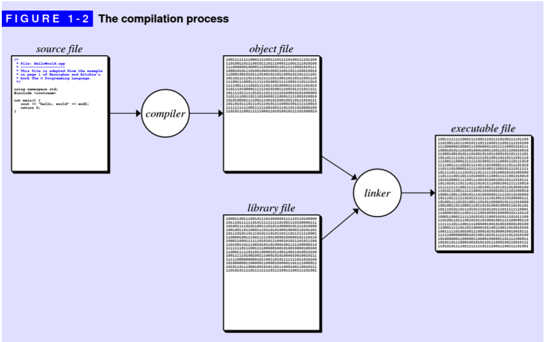

## An Overview of C++
### Your first C++ program
The only way to learn a new programming language is by writing programs in it. 

### The history of C++
* **machine language**, which consists of the primitive instructions that can be executed directly by machine. 
* **higher-level programming language**, is a programming language with strong abstraction from the details of the computer. 

#### The object-oriented paradigm
* **procedural paradigm**, in which programs consist of a collection of procedures and functions that operate on data. 
* **object-oriented paradigm**, in which programs are viewed instead as a collection of data objects that embody particular characteristics and behavior.

Programming paradigms are not so much competitive as they are complementary.

#### The compilation process
* **source file**: a file that contains program instructions.
* **compiler**: a computer program that translates computer code written in one programming language (the source language) into another language (the target language). 
* **object file**: a computer file containing object code, that is, machine code output of an assembler or compiler. 
* **executable file**: a file that is used to perform various functions or operations on a computer.
* **libraries**: a collection of non-volatile resources used by computer programs
* **linking**: the process of combining all the individual object files into an executable file



## The structure of a C++ program
### Comments
 A comment is text that is ignored by the compiler but which nonetheless conveys information to other programmers. 
 
* A comment consists of text enclosed between the markers /\*and\*/and may continue over several lines. 
* single-line comments, which begin with the characters // and extend through the end of the line. 

### Library inclusions
```
#include <iostream>
std::cout << "hello, world" << std::endl;
or 
#include <iostream>
using namespace std;
cout << "hello, world" << endl;
```
This line instructs the C++ compiler to read the relevant definitions from what is called a header file. The angle brackets in this line indicate that the header file is a system library that is part of standard C++.

* **header file**: A header file is a file with extension .h which contains C function declarations and macro definitions to be shared between several source files. 
* **namespace**:

#### Header files
A header file contains:   

* Function Definitions
* Data type definitions
* Macros

Types of header files:
	
* Pre-existing header files: Files which are already available in C/C++ compiler we just need to import them.
* User-defined header files: These files are defined by the user and can be imported using “#include”.

```
#include <filename.h>
or
#include "filename.h"
```

### Function Prototypes
A C++ prototype consists of the first line of the function definition followed by a semicolon, as illustrated by the prototype.

```
int raiseToPower(int n, int k);
```

You must provide the declaration or definition of each function before making any calls to that function. C++ requires such prototype declarations so the compiler can check whether calls to functions are compatible with the function definitions.

* **function**: functions are "self contained" modules of code that accomplish a specific task.
* **function prototypes**: a declaration of a function that specifies the function’s name and type signature (arity, data types of parameters, and return type), but omits the function body.

### The main program
Every C++ program must contain a function with the name main.By convention, C++ uses the value of the main function to report the status of the entire program. A value of 0 indicates success, any other value is taken as an indication of failure.


## Source Code
* [HelloWorld.cpp](./codes/HelloWorld.cpp)
* [PowerOfTwo.cpp](./codes/PowerOfTwo.cpp)


