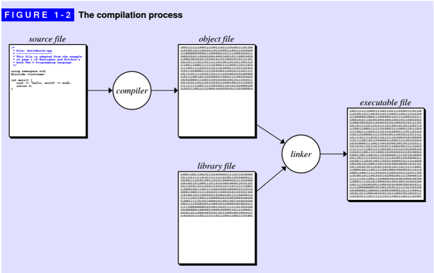
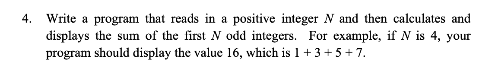
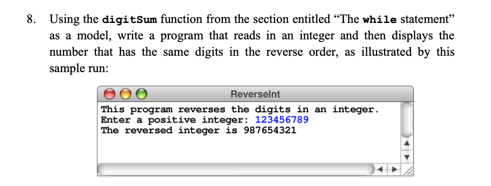
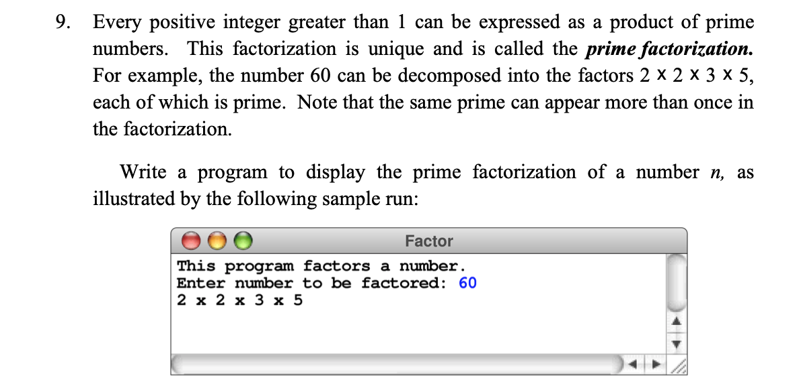

# An Overview of C++

## Your first C++ program

The only way to learn a new programming language is by writing programs in it.

## The history of C++

* **machine language**, which consists of the primitive instructions that can
  be executed directly by machine.
* **higher-level programming language**, is a programming language with strong
  abstraction from the details of the computer.

## The object-oriented paradigm

* **procedural paradigm**, in which programs consist of a collection of
  procedures and functions that operate on data.
* **object-oriented paradigm**, in which programs are viewed instead as a
  collection of data objects that embody particular characteristics and behavior.

Programming paradigms are not so much competitive as they are complementary.

## The compilation process

* **source file**: a file that contains program instructions.
* **compiler**: a computer program that translates computer code written in one
  programming language (the source language) into another language (the target
  language).
* **object file**: a computer file containing object code, that is, machine
  code output of an assembler or compiler.
* **executable file**: a file that is used to perform various functions or
  operations on a computer.
* **libraries**: a collection of non-volatile resources used by computer programs
* **linking**: the process of combining all the individual object files into an
  executable file



## The structure of a C++ program

### Comments

 A comment is text that is ignored by the compiler but which nonetheless conveys
 information to other programmers.

* A comment consists of text enclosed between the markers /\*and\*/and may
  continue over several lines.
* single-line comments, which begin with the characters // and extend through
  the end of the line.

### Library inclusions

```c++
#include <iostream>
std::cout << "hello, world" << std::endl;
or
#include <iostream>
using namespace std;
cout << "hello, world" << endl;
```

This line instructs the C++ compiler to read the relevant definitions from what
is called a header file. The angle brackets in this line indicate that the
header file is a system library that is part of standard C++.

* **header file**: A header file is a file with extension .h which contains C
  function declarations and macro definitions to be shared between several
  source files.
* **namespace**: In computing, a namespace is a set of signs (names) that are
  used to identify and refer to objects of various kinds. A namespace ensures
  that all of a given set of objects have unique names so that they can be
  easily identified.

### Header files

A header file contains:

* Function Definitions
* Data type definitions
* Macros

Types of header files:

* Pre-existing header files: Files which are already available in C/C++ compiler
  we just need to import them.
* User-defined header files: These files are defined by the user and can be
  imported using “#include”.

```c++
#include <filename.h>
or
#include "filename.h"
```

### Function Prototypes

A C++ prototype consists of the first line of the function definition followed
by a semicolon, as illustrated by the prototype.

```c++
int raiseToPower(int n, int k);
```

You must provide the declaration or definition of each function before making
any calls to that function. C++ requires such prototype declarations so the
compiler can check whether calls to functions are compatible with the function
definitions.

* **function**: functions are "self contained" modules of code that accomplish
  a specific task.
* **function prototypes**: a declaration of a function that specifies the
  function’s name and type signature (arity, data types of parameters, and
  return type), but omits the function body.

### variables

#### Naming conventions

The names used for variables, functions, types, constants, and so forth are
collectively known as identifiers.

* The name must start with a letter or the underscore character(_).
* All other characters in the name must be letters, digits, or the underscore.
  No space or other special characters are permitted in names.
* The name must not be one of the reversed keywords.

#### Local and global variables

* **local variables**, which are declared with the body of a function. The scope
  of a local variable extends to the end of the block in which it is declared.
* **global variables**, which are declared outside any function definition. The
  scope of a global variable is the remainder of the file in which it is
  declared, and it exists throughout the execution of a program.

#### constants

The keyword const at the beginning of this declaration indicates that the value
will not change after the variable is initialized, thereby ensuring that the
value remains constant.

```c++
const double PI = 3.14159265358979323846;
```

### Data type

In C++, every data value has an associated data type. From a formal perspective,
a data type is defined by two properties:

* domain: which is the set of values that belong to that type.
* a set of operations: which defines the behavior of that type.

### The main program

Every C++ program must contain a function with the name main.By convention, C++
uses the value of the main function to report the status of the entire program.
A value of 0 indicates success, any other value is taken as an indication of
failure.

### Exercises

* exercises-4

  
  solution: [SumOddInteger.cpp](./codes/SumOddInteger.cpp)

* exercises-8

  
  solution: [ReverseDigits.cpp](./codes/ReverseDigits.cpp)

* exercises-9

  
  solution: [PrimeFactorization.cpp](./codes/PrimeFactorization.cpp)

## Source Code

* [HelloWorld.cpp](./codes/HelloWorld.cpp)
* [PowerOfTwo.cpp](./codes/PowerOfTwo.cpp)
* [AddIntegerList.cpp](./codes/AddIntegerList.cpp)
* [Countdown.cpp](./codes/Countdown.cpp)
* [SumOddInteger.cpp](./codes/SumOddInteger.cpp)
