# Azure EntraID

The purpose of EntraID is to provide a central system for managing users, devices, and other principals to secure access to organizational acess.

1. Store users, groups, and properties.
2. Used to authenticate users

EntraID is a separate product, designed from the ground up to be a cloud-native identity store.

## Portal for managing

1. Azure Portal
2. Microsoft Entra admin center
3. Microsoft 365 admin center.

```mermaid
flowchart TD
    subgraph AzureEntraID["Azure Entra ID Tenant"]
        APIApp["🔒 Backend API App<br/>(Expose API: api://backend-app-id/user.read)"]
        ClientApp["🧑‍💻 Client App Registration<br/>(PKCE, Redirect URI)"]
    end

    User["👩 User (Browser: React/Swagger UI)"]
    ReactApp["🌐 React Frontend"]
    FastAPI["🚀 FastAPI Backend"]

    User -- "Accesses React App" --> ReactApp
    ReactApp -- "Initiate Login (PKCE)" --> ClientApp
    ClientApp -- "Authorize User" --> AzureEntraID
    AzureEntraID -- "Issue <br/>Access Token<br/>(aud=APIApp, <br/>scp=user.read)" --> ClientApp
    ClientApp -- "Redirect with Token" --> ReactApp
    ReactApp -- "Bearer Token in Authorization Header" --> FastAPI
    FastAPI -- "Validate Token (aud & scp)" --> APIApp
    FastAPI -- "Return Protected Data" --> ReactApp
```

