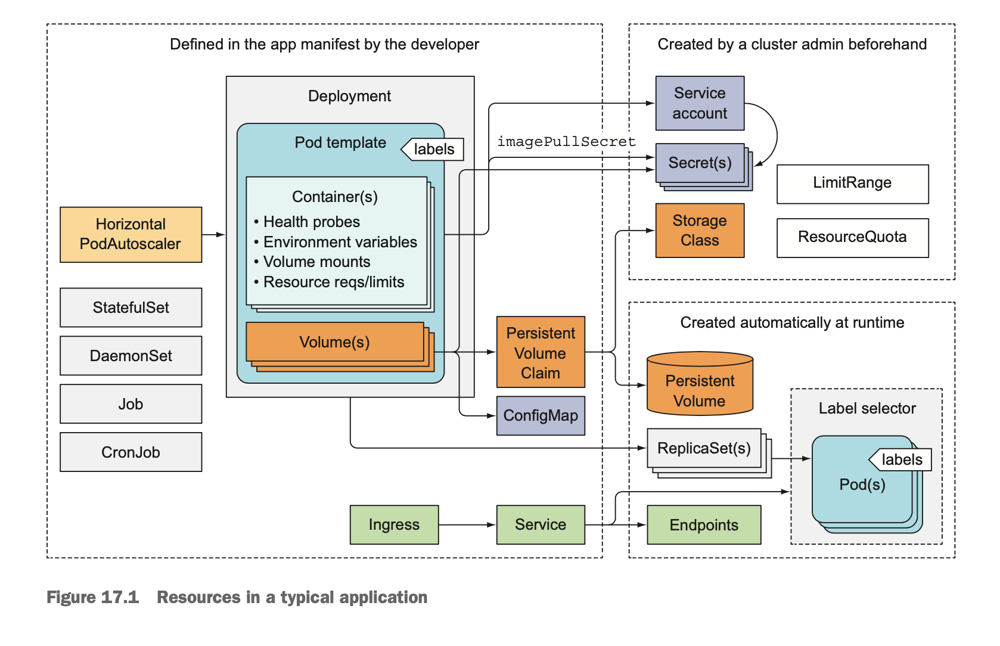

# Best practice for developing apps

A typical application manifest contains one or more Deployment and/or
StatefulSet objects. Those include a pod template containing one or more
container, with a liveness probe for each of them and a readiness probe for the
services the container provides. Pods that provide services to others are
exposed through one or more Services. When they need to be reachable from
outside the cluster, the Services are either configured to be LoadBalancer or
NodePort-type Services, or exposed through an Ingress resource.

The pod templates usually reference two types of Secrets - those for pulling
container images from private image registries and those used directly by the
process running inside from private image registries and those used directly by
the process running inside the pods. The Secrets themselves are usually not part
of the application manifest, because they aren't configured by the application
developers but by the operations team. Secrets are usually assigned to
ServiceAccounts, which are assigned to individual pods.

The application also contains one or more ConfigMaps, which are either used to
initialize environment variables or mounted as a ConfigMap volume in the pod.
Certain pods use additional volumes, such as an emptyDir or a gitRepo volume,
whereas pods requiring persistent storage use persistentVolumeClaim volumes. The
PersistentVolumeClaims are also part of the application manifest, whereas
StorageClasses referenced by them are created by system administrator upfront.

## Starting pods in a specific order

You can prevent a pod's main container from starting until a precondition is
met. This is done by including an init container in the pod.

### Init containers

Init containers are used to initialize the pod - this often means writing data
to the pod's volumes, which are then mounted into the pod's main container(s).
A pod may have any number of init containers. They're executed sequentially and
only after the last one completes are the pod's main containers started. An init
container could wait for a service required bu the pod's main container to be up
and ready.

#### Inter-pod dependencies

The application needs to handle internally the possibility that its dependencies
aren't ready. And don't forget readiness probes. If an app can't do its job
because one of its dependencies is missing, it should signal that through its
readiness probe, so Kubernetes knows it, too, isn't ready.

## Lifecycle hooks

* Post-start hooks
* Pre-stop hooks

These lifecycle hooks are specified per container, unlike init container, which
apply to the whole pod. Lifecycle hooks are similar to liveness and readiness
probes in that they can either:

* Execute a command inside the container
* Perform an HTTP GET request against a URL

A post-start hook is executed immediately after the container's main process is
started. You use it to perform additional operations when the application
starts.  Post-start hooks allows you to run additional commands without having
to touch the app. These may signal to an external listener that the app is
starting, or they may initialize the application so it can start doing its job.
The hook is run in parallel with the main process.

But even though the hook runs asynchronously, it does affect the container in
two ways. Until the hook completes, the container will stay in the Waiting state
with the reason `ContainerCreating`. Because of this, the pod's status will be
`Pending` instead of `Running`. If the hook fails to run or returns a non-zero
exit code, the main container will be killed.
