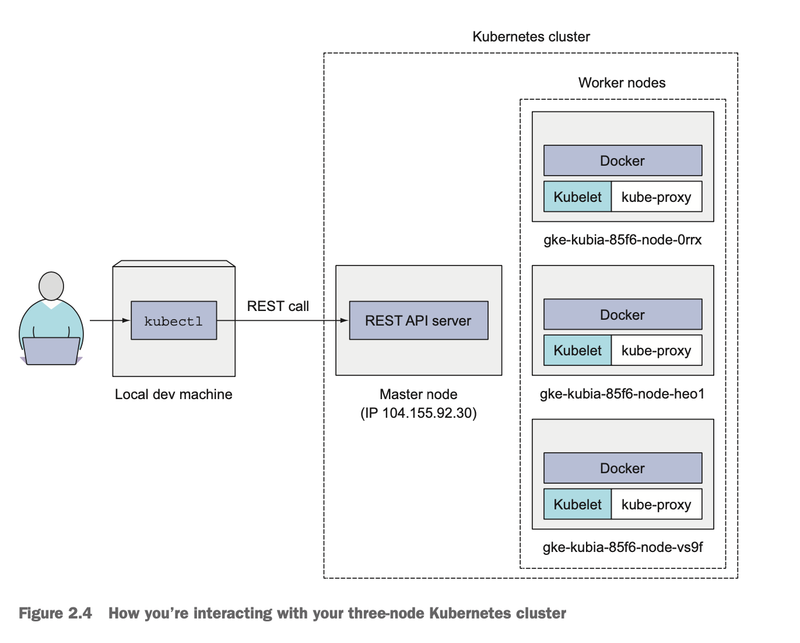

# Docker and Kubernetes

## Docker

```shell
$ docker build -t kubia .
$ docker run --name kubia-container -p 8080:8080 -d kubia
# -d The container will be detached from the console, which runs in background.
$ docker exec -it kubia-container bash
```

The build process isn't performed by the Docker client. Instead, the contents
of the whole directory are uploaded to the docker daemon and the image is built
there.

## Kubernetes



### Pods

A pod is a group of one or more tightly related containers that will always run
together on the same worker node and in the same Linux namespace. Each pod is
like a separate logical machine with its own IP, hostname, processes, and so on,
running a single application.

## References

* [kubernetes-dashboard](https://kubernetes.io/docs/tasks/access-application-cluster/web-ui-dashboard/)
