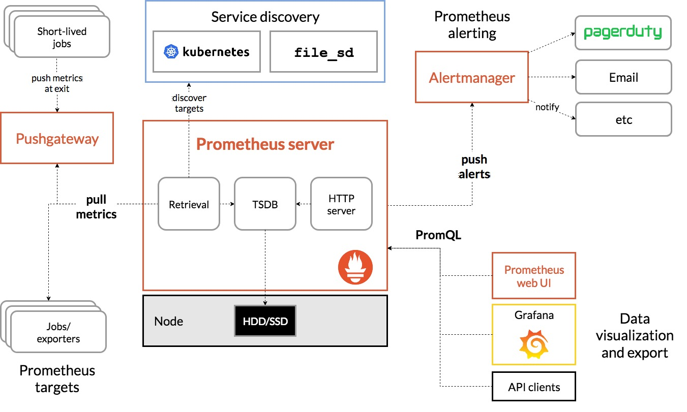

# Prometheus

Prometheus is an open-source systems monitoring and alerting toolkit. Prometheus
collects and stores its metrics as time series data. Metrics information is
stored with the timestamp at which it was recorded, alongside optional key-value
pairs called labels.

Prometheus is a full monitoring and trending system that includes built-in and
active scraping, storing, querying, graphing, and alerting based on time series
data.

## Features

* a multi-dimensional data model with time series data identified by metric name
  and key/value pairs
* PromQL, a flexible query language to leverage this dimensionality
* no reliance on distributed storage, single server nodes are autonomous
* time series collection happens via a pull model over HTTP
* pushing time series is supported via an intermediary gateway
* targets are discovered via service discovery or static configuration
* multiple modes of graphing and dashboarding support

## Architecture

Prometheus scrapes metrics from instrumented jobs, either directly or via an
intermediary push gateway for short-lived jobs. It stores all scraped samples
locally and runs rules over this data to either aggregate and record new time
series from existing data or generate alerts. Grafana or other API consumers
can be used to visualize the collected data.

## References

* [Prometheus](https://prometheus.io/docs/introduction/overview/)
