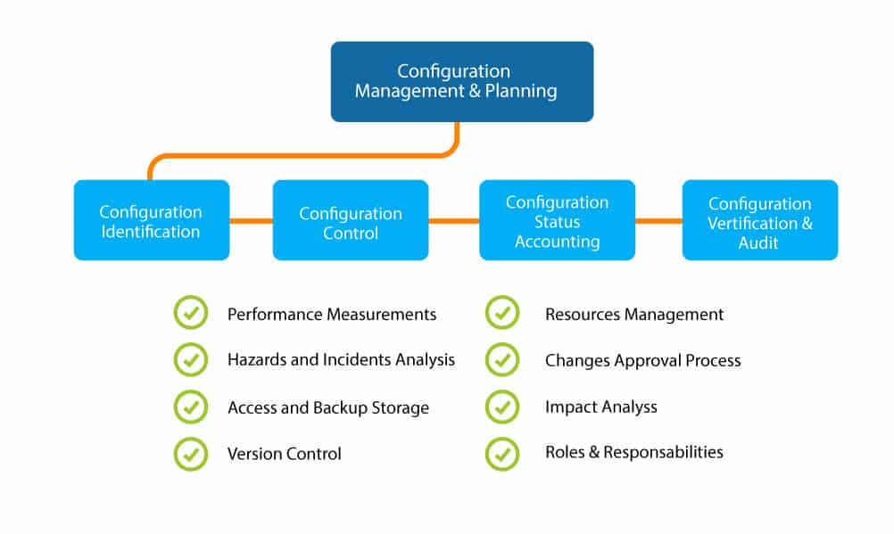

# Getting started with Ansible

## Infrastructure management

IT Infrastructure management includes the management of IT policies and
processes, along with the equipment, data, human resources and external
contacts (such as vendors or security organizations) needed to ensure that IT
operations run smoothly and efficiently.

## Configuration management

Configuration management (CM) is a systems engineering process for establishing
and maintaining consistency of a product's performance, functional, and
physical attributes with its requirements, design, and operational information
throughout its life.



Ansible was built by developers and sysadmins who know the command line - and
want to make a tool that helps them manage their servers exactly the same as
they have in the past, but in a repeatable and centrally managed way.

**Idempotence** is the ability to run an operation which produces the same
result whether run once or multiple times.

## Inventory file

Ansible uses an inventory to communicate with your servers.

```shell
ansible -i hosts.ini example -m ping -u [username]
```

## References

* [Configuration Management](https://www.plutora.com/blog/configuration-management)
* [wiki-CM](https://en.wikipedia.org/wiki/Configuration_management)
