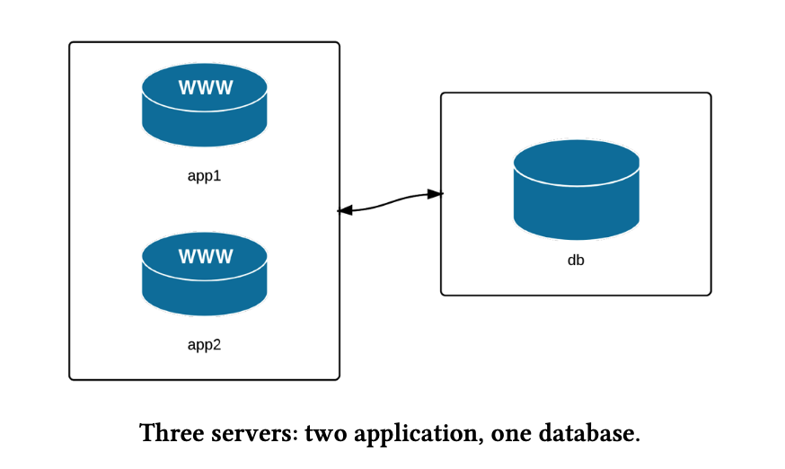

# Ad-Hoc Commands

An Ansible ad hoc command uses the `/usr/bin/ansible` command-line tool to
automate a single task on one or more managed nodes. `ad hoc` commands are quick
and easy, but they are not reusable.

## Build infrastructure with Vagrant



Refer to [VagrantFile](./codes/Vagrantfile) for configuration.

## Configuring ansible

### Configuration file

Certain settings in Ansible are adjustable via a configuration file
`(ansible.cfg)`. The stock configuration should be sufficient for most users,
but there may be reasons you would want to change them.

```ini
[default]
inventory = hosts.ini
```

refer to [ansible default configuration][1] for more details.

### Environmental configuration

Ansible also allows configuration of settings using environment variables.
If these environment variables are set, they will override any setting
loaded from the configuration file.

```shellscript
export ANSIBLE_BECOME_ASK_PASS=false
```

## Inventory file

[1]:<https://github.com/ansible/ansible/blob/stable-2.11/examples/ansible.cfg>
