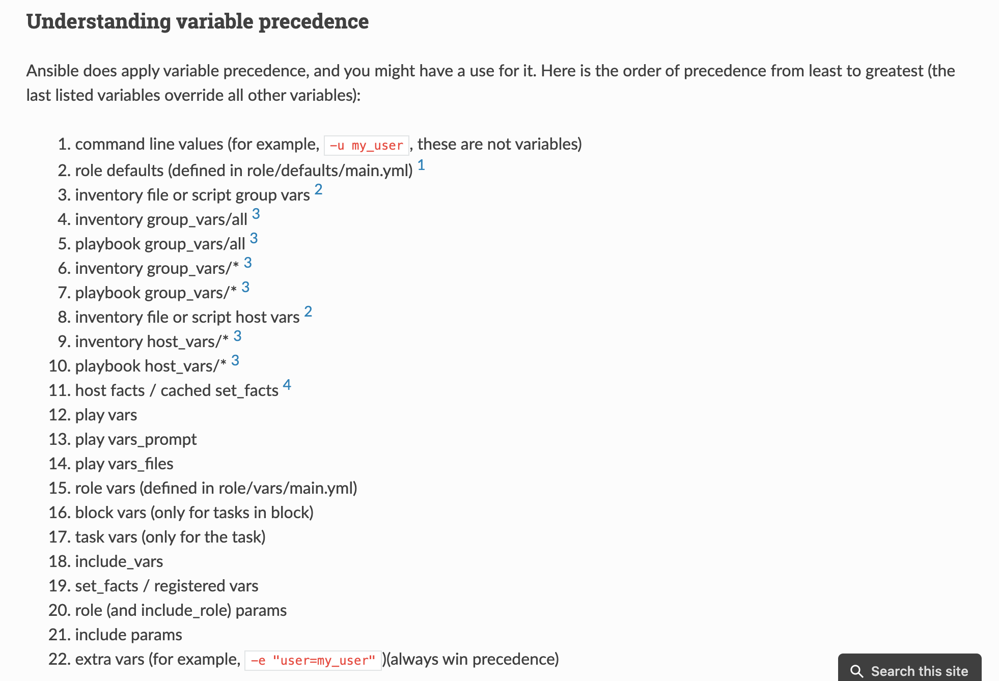

# Variables

Ansible uses variables to manage differences between systems. With Ansible,
you can execute tasks and playbooks on multiple different systems with a single
command. To represent the variations among those different systems, you can
create variables with standard YAML syntax, including lists and dictionaries.
You can define these variables in your playbooks, in your inventory, in
re-usable files or roles, or at the command line. You can also create variables
during a playbook run by registering the return value or values of a task as a
new variable.

## Define variables

### Playbook variables

* variables be included inline with the rest of a playbook, in a `vars`
  section
* variables be include in a separate file, using the `vars_files` seciton

```yaml
---
- hosts: example
  vars:
    foo: bar
  vars_files:
    - vars.yml

# import variables conditionally
  pre_tasks:
    - include_vars: "{{ item }}"
      with_first_found:
        - "appache_{{ ansible_od_family }}.yml"
        - "apache_default.yml"
```

### Inventory variables

You can define different variables for each individual host, or set shared
variables for a group of hosts in your inventory

* variables be included inline with a host definition
* variables be included in host variables and group variables
  Ansible will use the variables defined in the inventory
  `/etc/ansible/[host|group]_vars` directory first (if the appropriate files
  exist), then it will use variables defined in the playbook directories.

```yaml
[guangzhou]
app1.example.com proxy_state=present

# /etc/ansible/host_vars/app1.example.com
# /etc/ansible/group_vars/guangzhou
```

#### Magic variables

If you ever need ti retrieve a specific host's variables from another host,
Ansible provides a magic hostvars variable containing all the defined host
variables.

```yaml
{{ hostvars['host1']['admin_user']}}
```

* `groups`: A list of all group names in the inventory
* `group_names`: A list of all the groups of which the current host is a part.
* `inventory_hostname`: The hostname of the current host.
* `play_hosts`: All hosts on which the current play will be run.

### Registered variables

refer to [EnvironmentVariables.yaml](./codes/environment.yaml) for demo.

## Accessing variables

Simple variables can be used as part of a task using syntax like
`{{ variables }}`. For complex variables types, you can using Python array
access syntax or Jinjia filter syntax.

```yaml
- command: "/opt/my-app/rebuild {{ my_environment }}"
{{ ansible_eth0['ipv4']['address'] }}
{{ ansible_facts.eth0.ipv4.address }}
```

## Facts(variable derived from system information)

Variables related to remote systems are called facts. With facts, you can use
the behavior or state of one system as configuration on other systems.By
default, you can also access some Ansible facts as top-level variables with
the `ansible_` prefix.

To get a list of every gathered fact available, you can use the ansible
command with the setup module: `ansible app -m setup`

### Local Facts(Facts.d)

Define host-specific facts is to place a `.fact` file in a special directory
on remote hosts, `/etc/ansible/facts.d/`. These files can be either JSON or
INI files, or you can use executables that return JSON.

## Ansible Vault

Ansible Vault encrypts variables and files so you can protect sensitive content
such as passwords or keys rather than leaving it visible as plaintext in
playbooks or roles.

```yaml
ansible-vault encrypt vars/api_key.yml
ansible-playbook main.yml --ask-vault-pass
# store vault password in separate file
ansible-playbook main.yml --vault-password-file ~/.ansible/vault_pass.txt

ansible-vault view foo.yml
ansible-vault edit foo.yml
ansible-vault rekey foo.yml
```

You could also use an executable script(e.g. `~/.ansible/vault_pass.py` with
execute permissions, 700), as long as the script outputs a single line of
text, the vault password.

refer to [vaults](./codes/vaults) for demo.

## Variables precedence

In general, Ansible gives precedence to variables that were defined more
recently, more actively, and with more explicit scope. Variables in the
defaults folder inside a role are easily overridden.



## References

* [ansible-using variables](https://docs.ansible.com/ansible/latest/user_guide/playbooks_variables.html)
* [ansible-facts](https://docs.ansible.com/ansible/latest/user_guide/playbooks_vars_facts.html)
