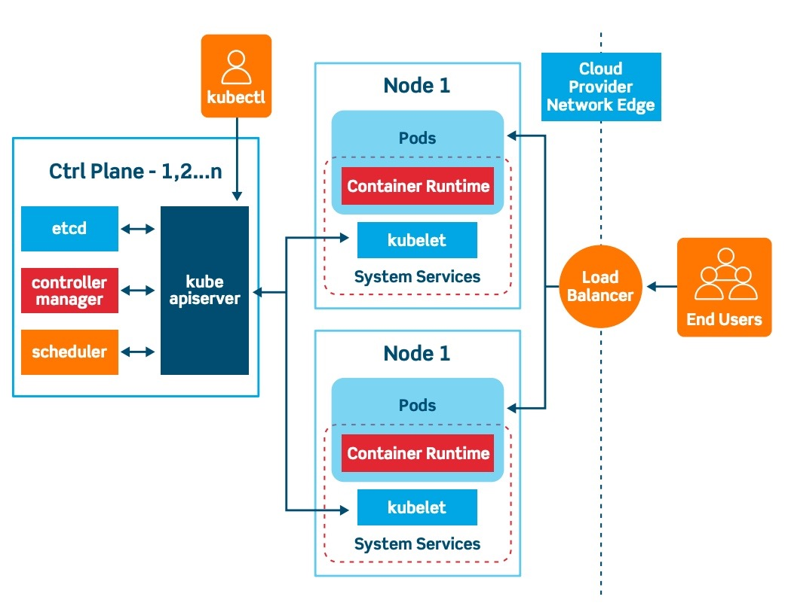
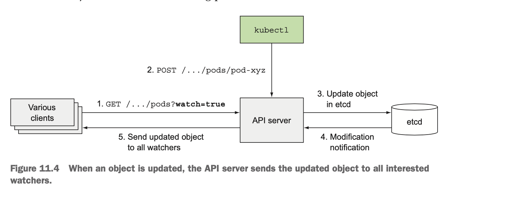
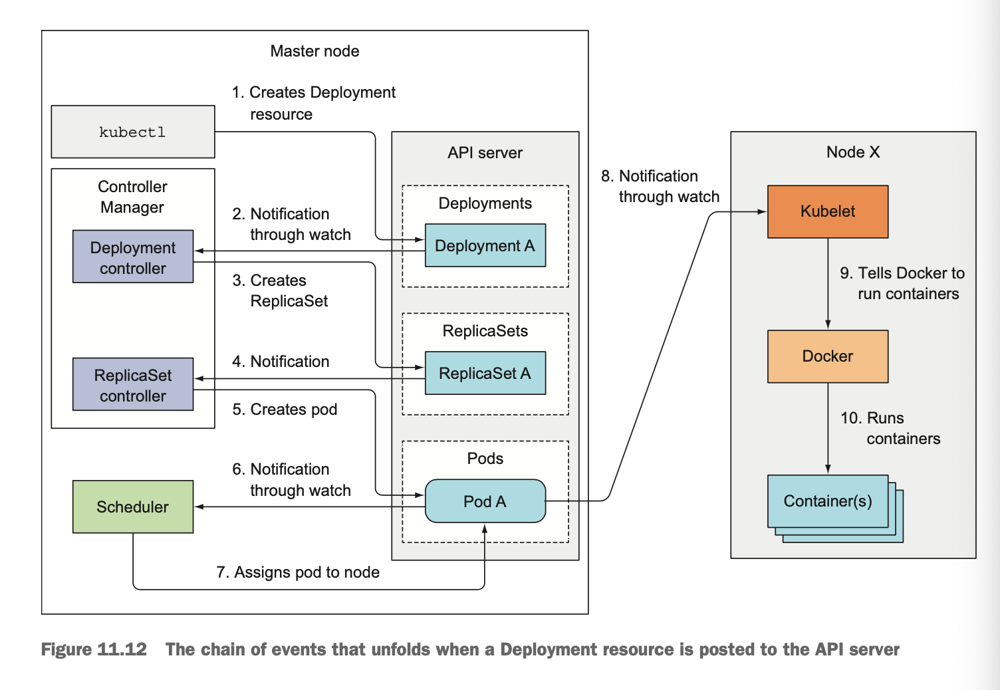

# Kubernetes Internals

## Architectures



### Add-on components

Beside the Control Plane components and the components running on the nodes, a
few add-on components are required for the cluster.

* The Kubernetes DNS server
* The Dashboard
* An Ingress Controller
* Heapster
* the Container Network Interface network plugin

### Components communication

Kubernetes system components communicate only with the API server. They don't
talk to each other directly. The API is the only component that communicates
with the etcd.

While multiple instances of etcd and API server can be active at the same time
and do perform their jobs in parallel, only a single instance of the Scheduler
and the Controller Manager may be active at a given time - with the others in
standby mode.

The Kubelet is the only component that always runs as a regular system
component, and it's the Kubelet that then runs all the other components as pods.

## The etcd component

Kubernetes use etcd, which is a fast, distributed, and consistent key-value
store. Because it's distributed, you can run more than one etcd instance to
provide both high availability and better performance.

All kubernetes resources include a `metadata.resourceVersion` field, which
clients need to pass back to the API server when updating an object. If the
version doesn't match the one stored in etcd, the API server rejects the update.

```shell
export ETCD_POD=$(kubectl get pods -n kube-system -l=component=etcd -o=jsonpath='{ .items[*].metadata.name}')
kubectl exec $ETCD_POD -n kube-system -- sh -c "ETCDCTL_API=3 etcdctl --endpoints https://127.0.0.1:2379 --cacert /run/config/pki/etcd/ca.crt --key /run/config/pki/etcd/server.key --cert /run/config/pki/etcd/server.crt get '/registry/pods/default/kubia-0' --prefix -w simple" | auger decode
```

In earlier versions of kubernetes, data written to etcd was stored as JSON and
could easily be inspected or manipulated using standard tools such as `etcdctl`.
In kubernetes 1.6+, for efficiency reasons, much of the data is now stored in a
binary storage representation, and is non-trivial to decode-- it contains a
enveloped payload that must be unpacked, type resolved and decoded. auger
provides kubernetes developers and cluster operators with simple way to access
the binary storage data via YAML and JSON, refer to
[auger](https://github.com/jpbetz/auger)

### Communicate with etcd

```shell
ETCDCTL_API=3 etcdctl --endpoints=https://127.0.0.1:2379 \
--cacert=<trusted-ca-file> --cert=<cert-file> --key=<key-file> \
snapshot save <backup-file-location>
```

Where `trusted-ca-file`, `cert-file` and `key-file` can be obtained from the
description of the etcd Pod.

## API Server

The Kubernetes API server is the central component used by all other components
and by clients, such as `kubectl`. It provides a CRUD interface for querying and
modifying the cluster state over a RESTful API. It stores that state in etcd.

* Authentication Plugins

  The API server need to authenticate the client sending the request. The API
  server calls these plugins in turn, until one of them determines who is
  sending the request.
* Authorization Plugins

  The authorization plugin determine whether the authenticated user can perform
  the requested action on the requested resource.
* Admission Plugins

  If the request is trying to create, modify, or delete a resource, the resource
  is sent through Admission Control. These plugins can modify the resource for
  different reasons.

After letting the request pass through all the Admission Control plugins, the
API server then validates the object, stores it in etcd, and returns a response
to the client.

The API server enable those controllers and other components to observe changes
to deployed resources. A Control Plane component can request to be notified
when a resource is created, modified, or deleted. This enables the component to
perform whatever task it needs in response to a change of the cluster metadata.



```shell
kubectl get pods -o yaml --watch
```

## Scheduler

Wait for newly created pods through the API server's watch mechanism and assign
a node to each new pod that doesn't already have the node set.

The Scheduler doesn't instruct the selected node to run the pod. All the
Scheduler does it update the pod definition through the API server. The API
server then notifies the Kubelet that the pod has bas been scheduled. As soon as
the Kubelet on the target node sees the pod has been scheduled to its node, it
creates and runs the pod's containers.

* Filtering the list of all nodes to obtain a list of acceptable nodes the pod
  can be scheduled to.
* Prioritizing the acceptable nodes and choosing the best one. If multiple nodes
  have the highest score, round-robin is used to ensure pods are deployed across
  all of them evenly.

The Scheduler can either be configured to suit your specific needs or
infrastructure specifics, or it can even be replaced with a custom
implementation altogether. You could also run a Kubernetes cluster without a
Scheduler, but then you'd have to perform the scheduling manually.

## Controller manager

* The API server doesn't do anything except store resources in etcd and notify
  clients about the change.
* The Scheduler only assigns a node to the pod.
* The Controller Manager make sure the actual state of the system converges
  toward the desired state.

The single Controller Manager process currently combines a multitude of
controllers performing various reconciliation tasks. Eventually, those
controllers will be split up into separate processes, enabling you to replace
each one with a custom implementation if necessary.

Resources are descriptions of what should be running in the cluster, whereas the
controllers are the active Kubernetes components that perform actual work as a
result of the deployed resources.

### What controllers do

Controllers do many different things, but they all watch the API server for
changes to resources and perform operations for each change, whether it's a
creation of a new object or an update or deletion of an existing object. In
general, controllers run a reconciliation loop, which reconciles the actual
state with the desired state, and writes the new actual state to the resource's
status section. Each controller connects to the API server and, through the
watch mechanism, asks to be notified when a change occurs in the list of
resources of any type the controller is responsible for.

### The Replication manager

Replication manager creates new Pod manifests, posts them to the API server, and
lets the Scheduler and the Kubelet do their job of scheduling and running the
pod. The REplication Manager performs its work by manipulating Pod API objects
through the API server.

All these controllers operate on the API objects through the API server. They
don't communicate with the Kubelet directly or issue any kind of instruction to
them. After a controller updates a resource in the API server, the Kubelet and
Kubernetes Service Proxies, also oblivious of the controller's existence,
perform their work, such as spinning up a pod's containers and attaching network
storage to them, or in the case of services, setting up the actual load
balancing across pods.

## Kubelet

Kubelet is the component responsible for everything running on a worker node.
Its initial job is to register the node it's running on by creating a Node
resources in the API server. Then it need to continuously monitor the API server
for Pods that have been scheduled to the node, and start the pod's containers.
It does this by telling the configured container runtime to run a container from
a specific container image. The Kubelet then constantly monitors running
containers and reports their status, events, and resource consumption to the
API server.

## Kubernetes service proxy

The purpose of `kube-proxy` is to make sure clients can connect to the services
you define through the Kubernetes API. The `kube-proxy` makes sure connections
to the service IP and port end up at one of the pods backing that service. When
a service is backed by more than one pod, the proxy performs load balancing
across those pods.

kube-proxy can run in three different modes:

* iptables(default mode)
* ipvs
* userspace("legacy" mode, not recommended anymore)

Each time a service is created/deleted or the endpoints are modified, kube-proxy
is responsible for updating the iptables rules on each node of the cluster.

## Kubernetes add-ons

Add-on components are deployed as pods by submitting YAML manifests to the API
server. Some of theses components are deployed through a Deployment resource or
a ReplicationControl resource, and some through a DaemonSet.

### DNS server

All the pods in the cluster are configured to use the cluster's internal DNS
server by default. This allows pods to easily look up services by name or even
the pod's IP addresses in the case of headless services.

### The event chain inside

Even before you start the whole process, the controllers, the Scheduler, and the
Kubelet are watching the API server for changes to their respective resources
types.



Both the Control Plane components and the Kubelet emit events to the API server
as them perform these actions. They do this by creating Event resources, which
are like any other Kubernetes resource. `kubectl get events --watch`

### The pause container

The pause container is the container that holds all the containers of a pod
together. The pause container is an infrastructure container whose sole purpose
is to hold all these namespaces. All other user-defined containers of the pod
then use the namespaces of the pod infrastructure container. The infrastructure
container's lifecycle is tied to the pod - the container runs from the time the
pod is scheduled until the pod is deleted.

## Inter-pod networking

You know that each pod gets its own unique IP address and can communicate with
all other pods through a flat, NAT-less network. The network is set up by the
system administrator or by a Container Network Interface(CNI) plugin, not by
Kubernetes itself. Kubernetes doesn't require you to use a specific networking
technology, but it does mandate that the pods can communicate with each other,
regardless if they're running on the same worker node or not.

Using Software Defined Network(SDN), which makes the nodes appear as though
they're connected to the same network switch, regardless of the actual
underlying network topology, no matter how complex it is. Packets sent from the
pod are encapsulated and sent over the network to the node running the other
pod, where they are de-encapsulated and delivered to the pod in their original
form.

## The Container Network Interface(CNI)

The CNI allows Kubernetes to be configured to use any CNI plugin that's out
there. Installing a network plugin, normally in the form of DaemonSet, which
ties into the CNI interface on the node.

### How services are implemented

Everything related to Service is handled by the `Kube-proxy` process running on
each node. Service gets its own stable IP address and port. The IP address is
virtual - it's not assigned to any network interfaces and is never listed as
either the source or the destination IP address in a network when the packet
leaves the node.

## High availability

Kubernetes High-Availability is about setting up Kubernetes, along with its
supporting components in a way that there is no single point of failure.

## References

* [etcd v3 encoded values](https://stackoverflow.com/questions/45744534/etcd-v3-cant-read-encoded-values)
