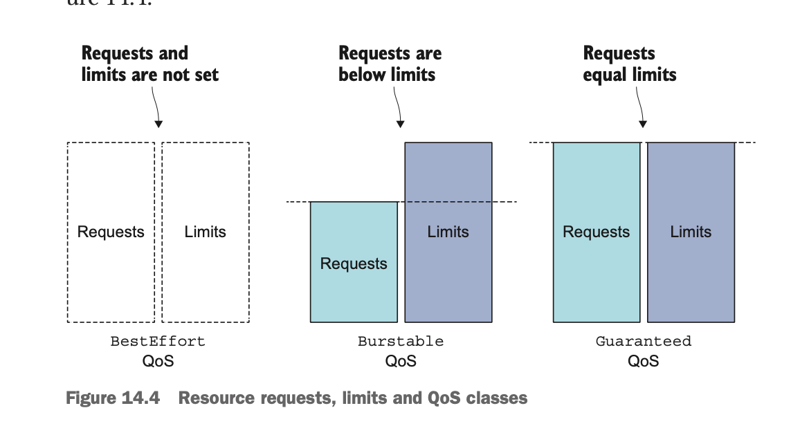

# Pod's computational resources

When creating a pod, you can specify the amount of CPU and memory that a
container need(requests) and a hard limit on what it may consume(limits). The
pod's resource requests and limits are the sum of the requests and limits of
all its containers.

```yaml
resources:
  requests:
    cpu: 200mi
    memory: 10Mi
```

In the pod manifest, your single container requires one-fifth of a CPU
core(200 milicores) to run properly. Five such pods/containers can run
sufficiently fast on a single CPU core.

## Scheduler

When scheduling a pod, the Scheduler will only consider nodes with enough
unallocated resources to meet the pod's resource requirement. The Scheduler
first filter the list of nodes to exclude those that the pod can't fit on and
then priorities the remaining nodes per the configured prioritization functions.

* LeastRequestedPriority: prefer nodes with fewer requested resources(with
  greater amount of unallocated resources)
* MostRequestedPriority: prefer nodes that have the most requested resource.

The Scheduler needs to know how much APU and memory each node has, the Kubelet
reports this data to the API server, making it available through the Node
resource. The Scheduler bases its decisions only on the allocatable resource
amounts.

```shell
kubectl run requests-pod-4 --image=busybox --restart Never --requests='cpu=1,memory=20Mi' -- dd if=/dev/zero of=/dev/null
```

The CPU requests don't only affect scheduling - they also determine how the
remaining CPU time is distributed between pods.

### Defining and requesting custom resources

Kubernetes also allows you to add your own custom resources to a node and
request them in the pod's resource requests.

An example of custom resource could be the number of GPU unit available on the
nodes. Pods requiring the use of a GPU specify that in their requests. The
Scheduler then makes sure the pod is only scheduled to nodes with at least one
CPU still unallocated.

## Resource Limit

To limit the amount of memory and CPU a container can consume.

```yaml
resources:
  limits:
    cpu: 1
    memory: 20Mi
```

The process or processes running inside the container will not be allowed to
consume more than 1 CPU core and 20 mebibytes memory.[Because you haven't
specified any resource requests, they'll be set to the same values as the
resource limits.]

Unlike resource requests, resource limits aren't constrained by the node's
allocatable resource amount. The sum of all limits of all the pods on a node is
allowed to exceed 100% of the node's capacity. Restated, resource limits can be
overcommitted. This has an important consequence - when 100% of the node's
resources are used up, certain containers will need to be killed.

### Exceeding the limits

CPU is a compressible resource, and it's only natural for a process to want to
consume all the CPU time when not waiting for an I/O operation. A process' CPU
usage is throttled, so when a CPU limit is set for a container, the process
isn't given more CPU time than the configured limit.

When a process tries to allocate memory over its limit, the process is killed
(it’s said the container is OOMKilled, where OOM stands for Out Of Memory). If
the pod’s restart policy is set to Always or OnFailure, the process is restarted
immediately, so you may not even notice it getting killed. But if it keeps going
over the memory limit and getting killed, Kubernetes will begin restart- ing it
with increasing delays between restarts.

Even though you set a limit on how much memory is available to a container, the
container will not be aware of this limit. Setting a CPU limit to one core
doesn't magically only expose only one CPU core to the container. All the CPU
limit does is constrain the amount of CPU time the container can use.

You may want to use the Downward API to pass the CPU limit to the container and
use it instead of relying on the number of CPUs your app can see on the system.
You can also tap into the cgroups system directly to get the configured CPU
limit by reading the following files:

```console
/sys/fs/cgroup/cpu/cpu.cfs_quota_us
/sys/fs/cgroup/cpu/cpu.cfs_period_us
```

## Pod QoS classes

Kubernetes determine pod's priority by categorizing pods into three Quality of
Service (QoS) classes.

* BestEffort(The lowest priority)
* Burstable
* Guaranteed(The highest)

### BestEffort classes

The lowest priority QoS class is the BestEffort class. It's assigned to pods
that don't have any requests or limits set at all. Containers running in these
these pods have had no resource guarantees whatsoever.

### Guaranteed classes

This class is given to pods whose containers' requests are equal to the limits
for all resources.

* Requests and limits need to be set for both CPU and memory
* They need to be set for each container
* They need to be equal(the limit needs to match the request for each resource
  in each container)

### Burstable classes

In between BestEffort and Guaranteed is the Burstable QoS class. All other pods
fall into this class.



When the system is overcommitted, the QoS classes determine which container gets
killed first so the freed resources can be given to higher priority pods.

Each running process has an OutOFMemory(OOM) score. The system selects the
process to kill by comparing OOM scores of all the running processes. When
memory needs to be freed, the process with the highest score gets killed.

OOM scores are calculated from two things: the percentage of the available
memory the process is consuming and a fixed OOM score adjustment, which is based
on the pod's QoS class and the container's requested memory.

## Setting default requests and limits for pods per namespace

Instead of specifying `requests` and `limits` for every container, you can also
do it by creating a LimitRange resource. It allows you to specify not only the
minimum and maximum limit you can set on a container for each resource, but also
the default resource requests for containers that don't specify requests
explicitly.

LimitRange resources are used by the LimitRanger Admission Control plugin. When
a pod manifest is posted to the API server, the LimitRanger plugin validates the
pod spec.  The limits specified in a LimitRange resource apply to each
individual pod/container or other kind of object created in the same namespace
as the LimitRange object. They don't limit the total amount of resources
available across all the pods in the namespaces.

If namespaces are used to separate different teams or to separate development,
QA, staging, and production pods running in the same Kubernetes cluster, using
a different LimitRange in each namespace ensures large pods can be created in
certain namespaces, whereas others are constrained to smaller pods.

## Limit the total resources available in a namespace

The ResourceQuota Admission Control plugin checks whether the pod being created
would cause the configured ResourceQuota to be exceeded. If that's the case, the
pod's creation is rejected. A ResourceQuota limits the amount of computational
resources the pods and the amount of storage PersistentVolumeClaims in a
namespace can consume. It can also limit the number of pods, claims, and other
API objects users are allowed to create inside the namespace.

A ResourceQuota object applies to the namespace it's created in, like a
LimitRange, but it applies to all the pod's resource requests and limits in
total and not each individual pod or container separately.

When a quota for a specific resource is configured, pods need to have the
request or limit set for that same resource, otherwise the API server will not
accept the pod. That's why having a LimitRange with default for those resources
can make life a lit easier for people creating pods.

A ResourceQuota can also be configured to limit the number of Pods,
ReplicationControllers, Services, and other objects inside a single namespace.
This allows the cluster admin to limit the number of objects users can create
based on their payment plan, and can limit the number of public IPs or node
ports Service can use.

Quotas can also be limited to a set of quota scopes. Four scopes are currently
available: BestEffort, NotBestEffort, Terminating, and NotTerminating.

The BestEffort and NotBestEffort scopes determine whether the quota applies to
pods with the BestEffort QoS class or with one of the other two classes.

The Terminating quota scope applies to pods that have the activeDeadlineSeconds
set, whereas the NotTerminating applies to those that don't. When creating a
ResourceQuota, you can specify the scopes that it applies to. A pod must match
all the specified scopes for the quota to apply to it.

## Monitoring pod resource usage

The Kubelet itself already contains an agent called cAdvisor, which performs the
basic collection of resource consumption data for both individual containers
running on the node and the node as a whole. Gather those statistics centrally
for the whole cluster requires you to run an additional component called
Heaspter.
