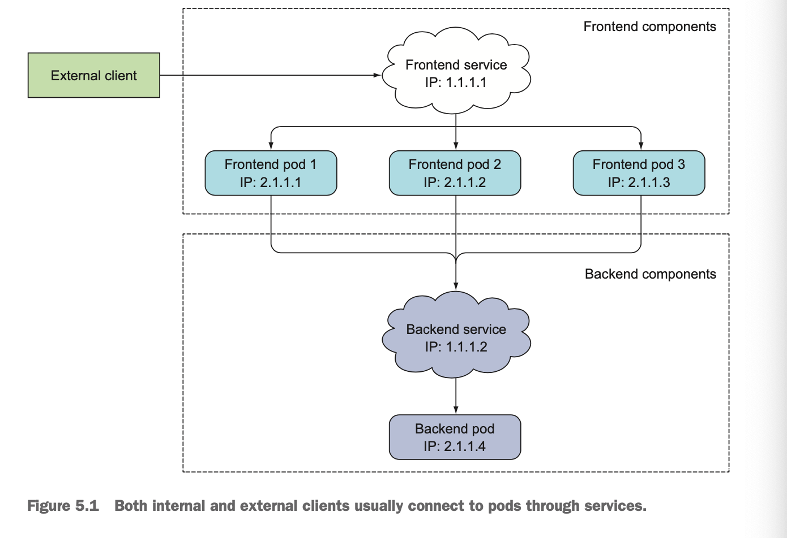

# Services

A Kubernetes Service is a resource you create to make single, constant point of
entry to group of pods providing the same service. Each service has an IP
address and port that never change while the service exists.



## Creating Services

### Configure session affinity on the service

If you want all requests made by a certain client to be redirected to the same
pod every time, you can set the service's `sessionAffinity` property to
`ClientIP`.

Kubernetes only support two types of service session affinity: None and
ClientIP.

```shell
# The double dash(--) in the command signals the end of command options for the
# kubectl. Everything after the double dash is the command that should be
# executed inside the pod.

$ kubectl exec kubia-5kqps -- curl -s http://10.110.0.35
```

### Using named ports

Using a named port enable you to change the port numbers without having to
change the service spec.

```yaml
kind: Pod
spec:
  containers:
  - name: kubia
    ports:
    - name: http
      containerPort: 8080
    - name: https
      containerPort: 8443
---
kind: Service
spec:
  ports:
  - name: http
    port: 80
    targetPort: http
  - name: https
    port: 443
    targetPort: https
```

## Discover services

### Environment variables

When a pod is stated, Kubernetes initializes a set of environment variables
pointing to each service that exists at that moment.

Dashes in the service name are converted to underscores and all letters are
uppercase when the service name is used as the prefix in the environment
variable's name.

### DNS

`kube-dns` runs a DNS server, which all other pods running in the cluster are
automatically configured to use. Any DNS query performed by a process running
in a pod will be handled by Kubernete's own DNS service, which knows all the
service running in your system.

Each service gets a DNS entry in the internal DNS server, and client pods that
know the name of the service can access it through its fully qualified domain
name(FQDN) instead of resorting to environment variables.

`backend-database.default.svc.cluster.local`

The service's cluster IP is a virtual IP, and only has meaning when combined
with the service port.

## Service outside cluster

### Service endpoint

An Endpoints resource is a list of IP addresses and ports exposing a service.
The selector is used to build a list of IPs and ports, which is then stored in
the Endpoint resource. When a client connects to a service, the service proxy
selects one of those IP and port pairs and redirects the incoming connection to
the server listening at that location.

### Exposing service to external clients

* Setting service type to NodePort. Each cluster node opens a port on the node
  itself and redirects traffic received on that port to the underlying service.
  The service isn't accessible only at the internal cluster IP and port, but
  also through a dedicated port on all nodes.
* Setting service type to LoadBalancer. This makes the service accessible
  through a dedicated load balancer, provisioned from the cloud infrastructure
  Kubernetes is running on. The load balancer redirects traffic to the node port
  across all the nodes. Clients connect to the service through the load
  balancer's IP.
* Creating an Ingress resources. It operates at the HTTP level and can thus
  offer more features than layer 4 services can.

#### NodePort

Service can be accessed not only through the service's internal cluster IP, but
also through any node's IP and the reserved node port.

```yaml
spec:
    type: NodePort
    ports:
    - port: 80
      targetPort: 8080
      nodePort: 30123
    selector:
        app: kubia
```

* port: This is the port of the service's internal cluster IP.
* targetPort: This is the target port of the backing pods.
* nodePort: This service will be accessible through port 30123 of each of your
  cluster nodes.

#### Load balancer

Kubernetes clusters running on cloud providers usually support the automatic
provision of a load balancer from the cloud infrastructure. A LoadBalancer type
service is a NodePort service with an additional infrastructure-provided load
balancer.

#### Ingress resources

Ingress: The act of going in or entering, the right to enter, a means or place
of entering.

Ingress only requires one public IP address, even when providing access to
dozens of services. When a client sends an HTTP request to the Ingress, the host
and path in the request determine which service the request is forwarded to.
Ingresses operate at the application layer of the network stack(HTTP) and can
provide features such as cookies-based session affinity and the like, which
services can't.

The client first performed a DNS lookup of `kubia.example.com`, and the DNS
server return the IP of the Ingress controller. The client then sent an HTTP
request to the Ingress controller and specified `kubia.example.com` in the Host
header. From that header, the controller determined which service the client is
trying to access, lookup up the pod IPs through the Endpoints object associated
with the service, and forwarded the client's request to one of the pods.

## Manifests

* [kubia-service.yaml](./kubia-service.yaml)
* [external-service-endpoints.yaml](./external-service-endpoints.yaml)
* [external-service.yaml](./external-service.yaml)
