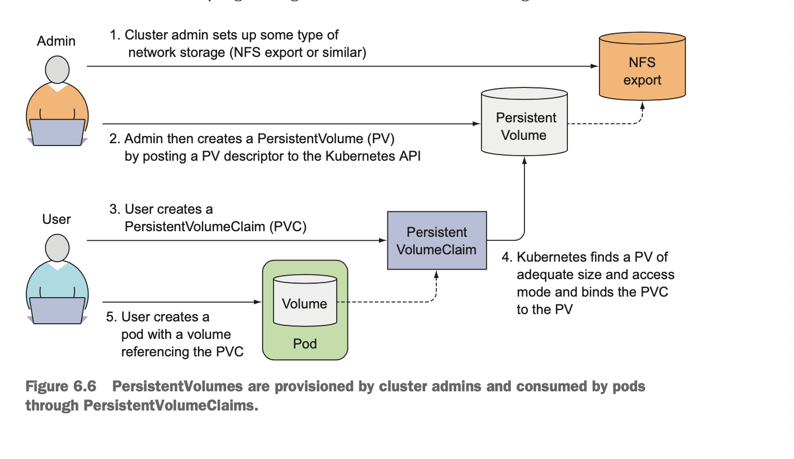
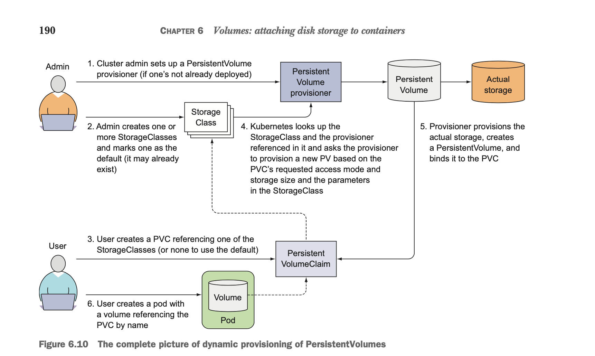

# Volumes

Every new container starts off with the exact set of files that was added to the
image at build time. You may not need to whole filesystem to be persisted, but
you do want to preserve the directories that hold actual data.

Kubernetes volumes are a component of a pod and are thus defined in the pod's
specification. A volume is available to all containers in the pod, but it must
be mounted in each container that needs to access it. In each container, you
can mount the volume in any location of its fielsystem.

A volume is bound to the lifecycle of a pod and will stay in existence only
while the pod exists, but depending on the volume type, the volume's files may
remain intact even after the pod and volume disappear, and later be mounted
into a new volume.

## Volume types

* emptyDir - A simple empty directory used for storing transient data.
* hostPath - Used for mounting directories from the worker node's fileystem into
  the pod.
* gitRepo - A volume initialized by checking out the contents of a Git
  repository.
* nfs - A NFS share mounted into the pod.
* gcePersistenDisk/awsElasticBlockStore - Used for mounting cloud
  provider-specific storage.
* cinder/cephfs - Used for mounting other types of network storage.
* configMap/secret - Special types of volumes used to expose certain Kubernetes
  resources and cluster information to the pod.
* persistentVolumeClaim - A way to use a pre- or dynamically provisioned
  persistent storage.

## Using volumes to share data between containers

### EmptyDir Volume

An emptyDir volume is especially useful for sharing files between containers
running in the same pod.[A container's filesystem may not even be writable, so
writing to a mounted volume might be the only option]

```yaml
volumes:
  - name: html
    emptyDir:
        medium: Memory
```

### GitRepo

A gitRepo volume is basically an emptyDir volume that gets populated by cloning
a Git repository and checkout out a specific revision when the pod is starting
up. After the gitRepo volume is created, it isn't kept sync with the repo it's
referencing.

#### Sidecar container

A sidecar container is a container that augments the operation of the main
container of the pod. You add a sidecar to a pod so you can use an existing
container image instead of cramming additional logic into the main app's code,
which would make it overly complex and less reusable.

### HostPath

Certain system-level pods do need to either read the node's files or use the
node's filesystem to access the node's devices through the filesystem.
Kubernetes makes this possible through a hostPath volume.

A hostPath volume points to a specific file or directory on the node's
filesystem.

Remember to use hostPath volumes only if you need to read or write system files
on the node. Never use them to persist data across pods.

## Persistent storage

Data needs to be accessible from any cluster node, it must be stored on some
type of network-attached storage(NAS).

### GCEPersistentDisk

```yaml
spec:
  volumes:
  - name: mongodb-data
    gcePersistentDisk:
      pdName: mongodb
      fsType: ext4
  containers:
  - image: mongo
    name: mongo
    volumeMounts:
    - name: mongodb-data
      mountPath: /data/db
```

### NFS

```yaml
volumes:
- name: mongodb-data
  nfs:
    server: 1.2.3.4
    path: /some/path
```

## Decoupling pods from the underlying storage technology

When a developer needs a certain amount of persistent storage for their
application, they can request it from Kubernetes, the same way they can request
CPU, meamory, and other resources when creating a pod. The system administrator
can configure the cluster so it can give the apps what they request.



When creating the PersistentVolume, the admin specifies its size and the access
modes it supports. PersistentVolumes don't belong to any namespace, they're
cluster-level resources like nodes.

Volume Access Mode:

* RWO - ReadWriteOnce - Only a single node can mount the volume for reading and
  writing.
* ROX - ReadOnlyMany - Multiple nodes can mount the volume for reading.
* RWX - ReadWriteMany - Multiple nodes can mount the volume for both reading
  and writing.

The STATUS columns shows the PersistentVolume as Released, not Available.

The Volume Recycle Policy:

* Retain: The Retain reclaim policy allows for manual reclamation of the
  resource.
* Recycle: delete the volume's contents and makes the volume available to be
  claimed again. This way, the PersistentVolume can be reused multiple times by
  different PersistentVolumeClaim and different pods.
* Delete: delete the underlying storage.

## Dynamic provisioning of PersistentVolumes

The cluster admin, instead of creating PersistentVolumes, can deploy a
PersistentVolume provisioner and define one or more StorageClass objects to let
users choose what type of PersistentVolume they want. The users can refer to the
StorageClass in their PersistentVolumeClaims and the provisioner will take that
into account when provisioning the persistent storage.

The StorageClass resource specifies which provisioner should be used for
provisioning the PersistentVolume when a PersistentVolumeClaim requests this
StorageClass. The parameters defined in the StorageClass definition are passed
to the provisioner and are specific to each provisioner plugin.

The cluster admin can create multiple storage classes with different performance
or other characteristics. The developer then decides which one is most
appropriate for each claim they create.

Explicitly set storageClassName to "" if you want the PVC to use a
pre-provisioned PersistentVolume.


