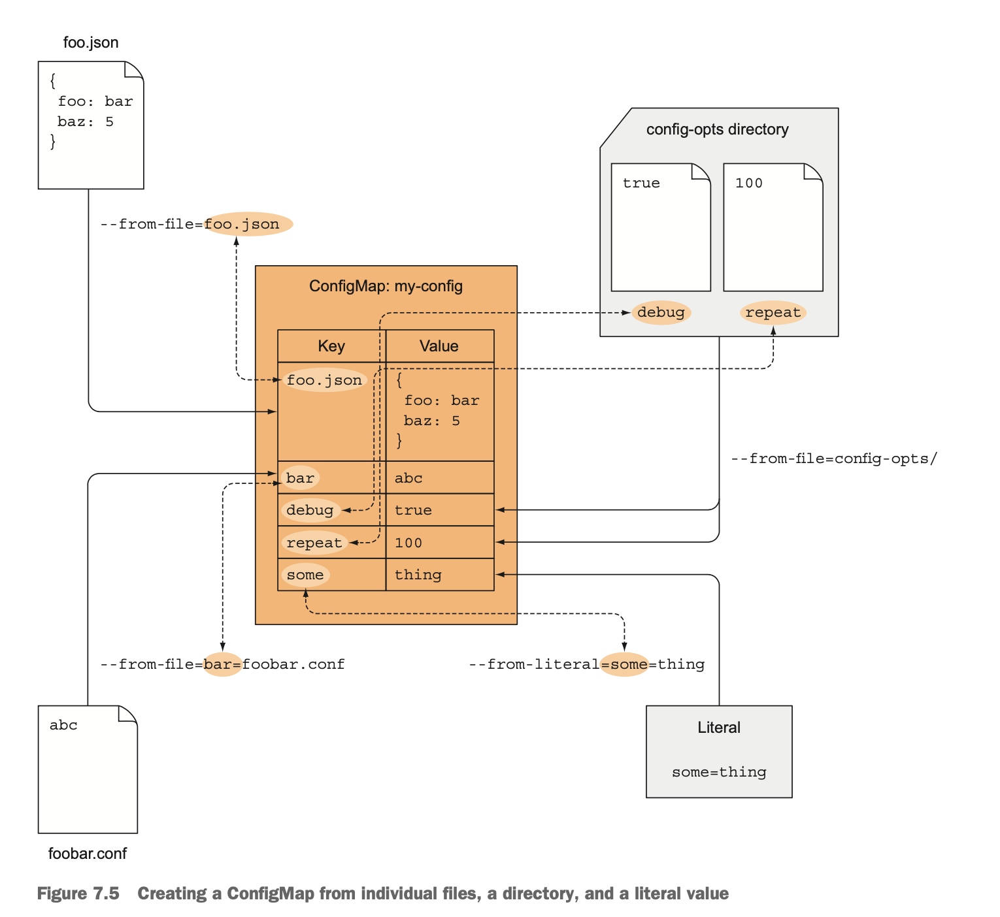

# ConfigMaps and Secrets

You can config your app by:

* Passing command-line arguments to containers
* Setting custom environment variables for each container
* Mounting configuration files into containers through a special type of volume

## Command-line arguments

In a Dockerfile, two instructions define the two parts:

* ENTRYPOINT defines the executable invoked when the container is started.
* CMD specifies the arguments that get passed to the ENTRYPOINT

```yaml
# You don't need to enclose string value in quotations mark, but you must enclose numbers
spec:
  containers:
  - image: luksa/fortune:args
    args:
    - foo
    - bar
    - "15"
```

## Environment variables

Kubernetes allows you to specify a custom list of environment variables for each
container of a pod.

```yaml
spec:
  containers:
  - image: luksa/fortune:env
    env:
    - name: INTERVAL
      value: "30"
    - name: FIRST_VAR
      value: "foo"
    - SECOND_VAR
      value: "$(FIRST_VAR)bar"
    name: html-generator
```

Having values effectively hardcoded in the pod definition means you need to have
separate pod definitions for your production and your deployment pods. To reuse
the same pod definition in multiple environments, it makes sense to decouple the
configuration from the pod descriptor.

## ConfigMap

Kubernetes allows separating configuration options into a separate object called
a ConfigMap, which is a map containing key/value pairs with the values ranging
from short literals to full config files.

```shell
kubectl create configmap fortune-config --from-literal=sleep-interval=25
kubectl create configmap my-config --from-file=config-file.conf
# Specify the key manually
kubectl create configmap my-config --from-file=customkey=config-file.conf
# Create an individual map entry for each file in the specified directory
kubectl create configmap my-config --from-file=/path/to/dir
```



### Exposing all entries

Kubernetes doesn't convert the keys in any way(it dosen't convert dashes to
underscores). If a ConfigMap key isn't in the proper format, it skips the entry.

```yaml
spec:
  containers:
  - image: some-image
    envFrom:
    - prefix: CONFIG_
      configMapRef:
        name: my-config-map
```

### ConfigMap entry as command-line arguments

You can't reference CofnigMap entries directly in the `pod.spec.containers.args`
field, but you can first initialize an environment variable from the ConfigMap
entry and then refer to the variable inside the argument.

```yaml
env:
- name: INTERVAL
  valueFrom:
    configMapKeyRef:
      name: fortune-config
      key: sleep-interval
  args: ["$(INTERVAL)"]
```

### ConfigMap volume

A configMap volume will expose each entry of the ConfigMap as a file. The
process running in the container can obtain the entry's value by reading the
contents of the file.

To define which entries should be exposed as files in a configMap volume, use
the volume's items. When specifying individual entries, you need to set the
filename for each individual entry, along with entry's key.

```yaml
volumes:
- name: config
  configMap:
    name: fortune-config
    items:
    - key: my-nginx-config.conf
      path: gzip.conf
```

When you mount the volume as a directory, the directory only contains the files
from the mounted filesystem, whereas the original files in that directory are
inaccessible for as long as the filesystem is mounted. You can use the subPath
property to mount it there without affecting any other files in that directory.

```yaml
spec:
  containers:
  - image: some/image
    volumeMounts:
    - name: myvolume
      mountPath: /etc/someconfig.conf
      subPath: myconfig.conf
  volumes:
  - name: config
    configMap:
      name: fortune-config
      defaultMode: "6600"
```

The `subPath` property can be used when mounting any kind of volume. Instead of
mounting the whole volume, you can mount part of it.
