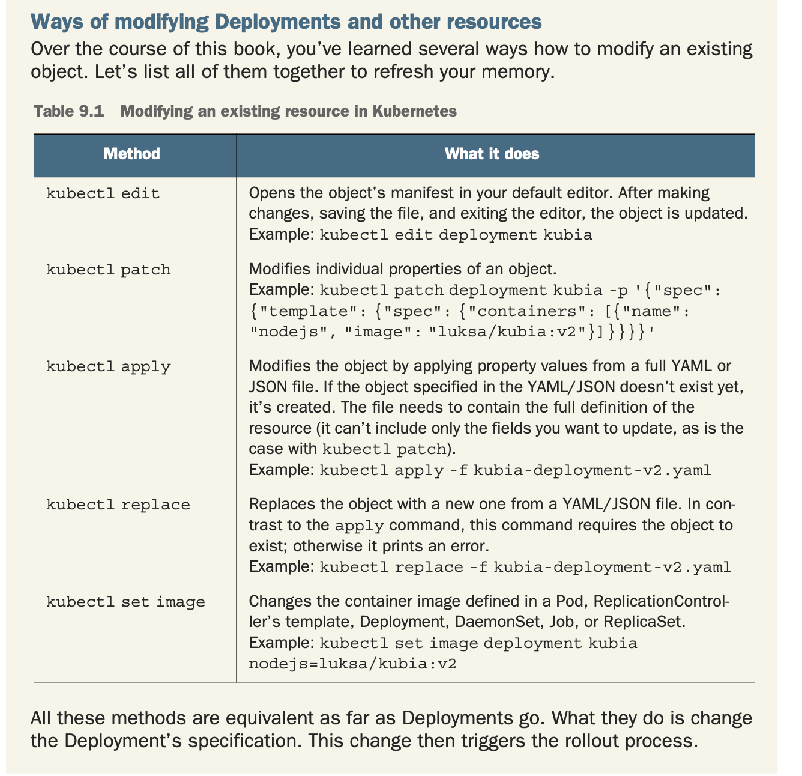

# Deployments

A Deployment provides declarative updates for Pods and ReplicaSets. You describe
a desired state in a Deployment, and the Deployment controller changes the
actual state to the desired state at ta controlled rate. You can define
Deployments to create new ReplicaSets, or to remove existing Deployments and
adopt all their resources with new Deployments.

## Deployment strategies

The default strategy is to perform a rolling update.(RollingUpdate). The
alternative is the Recreate strategy, which deletes all the old pods at once and
then creates new one. The Recreate strategy causes all old pods to be deleted
before the new ones are created.



The controllers running as part of Kubernetes control plane then performed the
update. The process wasn't performed by the `kubectl` client. And be aware that
if the pod template in the Deployment references a ConfigMap(or a Secret),
modifying the ComfigMap will not trigger an update. One way to trigger an update
when you need to modify an app's config is to create a new ConfigMap and modify
the pod template so it references the new ConfigMap.

```shell
kubectl set image deployment kubia nodejs=luksa/kubia:v3
kubectl rollout status deployment kubia
kubectl rollout undo deployment kubia

# View the rollout hostory and jump between
kubectl rollout history deployment kubia
kubectl rollout undo deployment kubia --to-revision=1

# A canary release
kubectl rollout pause deployment kubia
kubectl rollout resume deployment kubia
```

### Controlling the rate of rollout

Two properties affect how many pods are replaced at once during a Deployment's
rolling update.

* maxSurge: Determine how many pod instance allow to exist above the desired
  replica count configured on the Deployment. [defaults to 25%, round up]
* maxUnavailable: Determines how many pod instances can be unavailable relative
  to the desired replica count during the update.[default to 25%, round down]

It's important to keep in mind that maxUnavailable is relative to the desired
replica count.

The `minReadySeconds` property specifies how long a newly created pod should be
ready before the pod is treated as available. Until the pod is available, the
rollout process will not continue. A pod is ready when readiness probes of all
its containers return a success. If a new pod isn't functioning properly and its
readiness probe starts failing before `minReadySeconds` have passed, the rollout
of the new version will effectively be blocked.

If you only define the readiness probe without setting minReadySeconds properly,
new pods are considered available immediately when the first invocation of the
readiness probe succeeds. If the readiness probe starts failing shortly after,
the bad version is rolled out across all pods. Therefore, you should set
minReadySeconds appropriately.
