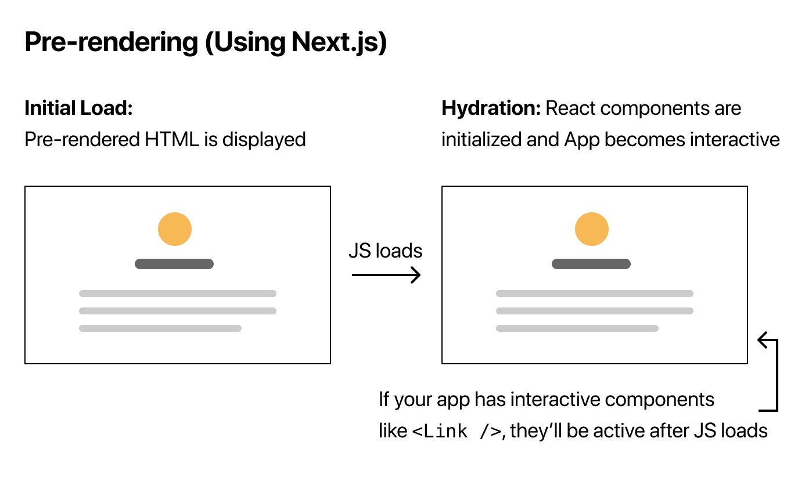

# Nextjs

## Pre-fetching and Data fetching

By default, Next.js pre-renders every page. This means that Next.js generates
HTML for each page in advance, instead of having it done by client-side
Javascript. Pre-rendering can result in better performance and SEO.

Each generated HTML is associated with minimal Javascript code necessary for
that page. When a page is loaded by the browser, its Javascript code runs and
makes the page full interactive.



## Difference ways of pre-rendering

* Static Generation: is the pre-rendering method that generates the HTML at
  build time. The pre-rendered HTML is then reused on each request.
* Server-side Rendering: is the pre-rendering method that genetates the HTML
  on each request.

When going to production, Static Generation will happen once, at build time, and
not on every request.

## When to use

We recommend using Static Generation whenever possible, because your page can be
built once and served by CDN, which makes it much faster than having a server
render the page on every request.

If the page shows frequently updated data, and the page content changes on every
request, use the Server-side pre-rendering instead.

## Static Generations

Static generation is the pre-rendering method that generates the HTML at build
time. The pre-rendered HTML is then reused on each request.

For pages that can be generated without fetching external data at build time.
The `next build` builds the app for production. You can use the `getStaticProps`
when you try to render the HTML with first fetching some external data.

```js
export async function getStaticProps() {
  const allPostsData = getSortedPostData();
  return {
    props: {
      allPostsData,
    },
  };
```

The `getStaticProps` only runs on the server-side. It will never run on the
client side. It won't even be included in the JS module for the browser. In
production, `getStaticProps` runs at build time. Because it's meant to be run
at build time, you won't be able to use data that's only available during
request time, such as query parameters or HTTP headers.

`getStaticProps` can only be exported from a page. You can't export it from
non-page files. One of the reasons for this restriction is that React needs to
have all the required data before the page is rendered.

## Server-side rendering

Server-side Rendering is the pre-rendering method that generates the HTML on
each request.

```js
export async function getServerSideProps(context) {
  return {
    props: {
      // props for your component
    },
  };
}
```

You should use `getServerSideProps` only if you need to pre-render a page whose
data must be fetched at request time. Time to first byte(TTFB) will be slower
than `getStatisProps` because the server must compute the result on every
request, and the result cannot be cached by a CND without extra configuration.

## Client-side rendering

* Statically generate (pre-render) parts of the page that do not require
  external data.
* When the page loads, fetch external data from the client using Javascript and
  populate the remaining parts.

## SWR

The team behind Next.js has created a React hook for data fetching call `SWR`.
You can use it if you're fetching data on the client side. It handles caching,
revalidation, focus tracking, refetching on interval.

