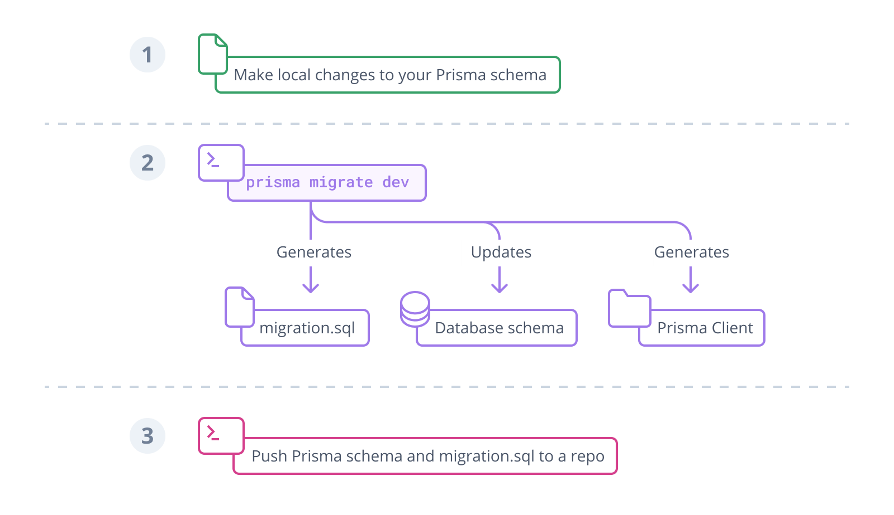

# Prisma

Prisma is a next-generation ORM that consists of these tools:

* Prisma Client: Auto-generated and type-safe query builder of Node.js &
  Typescript
* Prisma Migrate: Declarative data modeling & migration system
* Prisma Studio: GUI to view and edit data in your database

## The Prisma schema

Every project that uses a tool from the Prisma toolkit starts with a Prisma
schema file. The Prisma schema allows developers to define their models in an
intuitive data modeling language. It also contains the connection to a database
and defines a generator.

* Data source: Specifies your database connection(via an environment variable).
* Generator: Indicates that you want to generate Prisma Client.
* Data model: Defines your application models.

## The Prisma data model

The data model is a collection of models. A model has two major functions:

* Present a table in the underlying database
* Provide the foundation for the queries in the Prisma Client API

Once the data model is defined, you can generate Prisma Client which expose CRUD
and more queries for the defined models. If you're using TypeScript, you'll get
full type-safety for all queries.

## The Prisma Client

Use the Prisma client to access the data source, and use the `prisma generate`
command to read your Prisma schema and generate the Prisma Client code. The code
will be located in `node_modules/.prisma/client`, which is exported by the
`node_modules/.prisma/client` get updated.

## Typical Prisma workflow

With Prisma Migrate, Prisma's integrated database migration tool, the workflow
looks as follows:

1. Manually adjust your Prisma data model
2. Migrate your development database using the `prisma migrate dev` CLI command
3. Use Prisma Client in your application code to access your database

