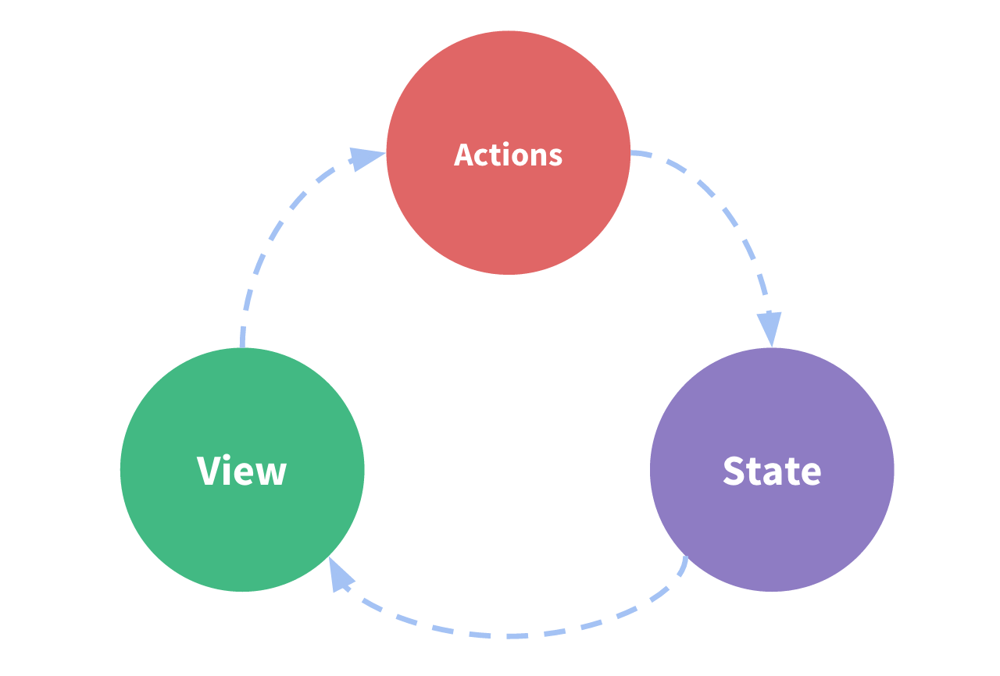

# Redux

Redux is a pattern and library for managing and updating application state,
using events called "actions". It serves as a centralized store for state that
needs to be used across your entire application, with rules ensuring that the
state can only be updated in a predictable fashion.

## Redux Libraries and Tools

* React-Redux: Official package that lets your React components interact with a
  Redux store by reading pieces of state and dipatching actions to update the
  store.
* Redux Toolkit: Contains packages and functions that we think are essential for
  building a Redux app.
* Redux DevTools Extension: Shows a history of the changes to the state in your
  Redux store over time

## Redux Terms and Concepts

### State Management

* The state, the source of truth that drives our app
* The view, a declarative description of the UI based on the current state.
* The actions, the events that occur in the app based on user input, and trigger
  updates in the state.



### Immutability

In order to update values immutably, your code must make copies of existing
objects/arrays, and then modify the copies. React expects that all state updates
are done immutably.

### Terminology

1. Actions: An action is a plain JavaScript object that has a `type` field. You
  can think of an action as an event that describes something that happened in
  the application.
2. Action Creators: An action creator is a function that creates and returns an
  action object.
3. Reducer: A reducer is a function that receives the current `state` and an
  `action` object, decides how to update the state if necessary, and returns the
  new state: `(state, action) => newState`. You can think of a reducer as an
  event listener which handles events based on the received action type.
4. Store: The current Redux application state lives in an object called the
  store.
5. Dispatch: The only way to update the state is to call `store.dispatch()` and
  pass in an action object.
6. Selectors: Selectors are functions that know how to extract specific pieces
  of information from a store state value. As an application grows bigger, this
  can help avoid repeating logic as different parts of the app need to read the
  same data.

## Redux App Structure

Reduce Slices: A "slice" is a collection of Redux reducer logic and actions for
a single feature in your app, typically defined together in a single file.The
name comes from splitting up the root Redux state object into multiple "slice"
of state.

```js
function rootReducer(state = {}, action) {
    return {
        users: usersReducer(state.users, action),
        posts: postsReducer(state.posts, action),
        comments: commentsReducer(state.comments, action)
    }
}

const store = configureStore({
  reducer: rootReducer
})
```

Redux Toolkit has a function called `createSlice`, which takes care of the work
of generating action type strings, action creator functions, and action objects.
All you have to do is define a name for this slice, write an object that has
some reducer functions in it, and it generates the corresponding action code
automatically. The string from the `name` option is used as the first part of
each action type, and the key name of each reducer function is used as the
second part.

`createSlice` uses a library called `Immer` inside. Immer uses a special JS tool
called a `Proxy` to wrap the data you provide, and lets you write code that
"mutate" that wrapped data. But Immer tracks all the changes you've tried to
make, and then uses that list of changes to return a safely immutably updated
value, as if you'd written all the immutable update logic by hand.

A `thunk` is a specific kind of Redux function that can contain asynchronous
logic. Thunks are written using two functions:

* An inside thunk function, which gets `dispatch` and `getState` as arguments.
* The outside creator function, which creates and returns the thunk function.

### Reading data with useSelector

The `useSelector` hook lets our component extract whatever pieces of data it
needs from the Redux store state. The `useSelector` takes care of talking to the
Redux store behind the scenes for us. If we pass in a selector function, it
calls `someSelector(store.getState())` for us, and returns the result.

In a React + Redux app, your global state should go in the Redux store, and your
local state should stay in React components.

