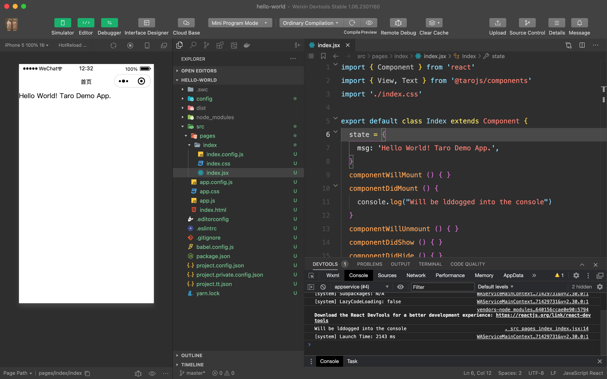

# Taro

## 完成基于 Taro 的 `hello world` 小程序

1. 安装对应的工具与环境
2. 掌握基础 Taro CLI 的使用
3. 理解基础项目目录结构及功能

基础流程为使用 Taro 进行项目初始化，使用 React 语法进行代码编写，并通过相关 CLI
命令进行小程序编译，最后在小程序开发者工具中进行查看，效果如下：

## 复现 `Taro v2ex` 小程序

1. 学习 [Taro 渐进式入门教程](https://docs.taro.zone/docs/guide)，了解相关 Taro
  开发概念
2. 本地复现 [Taro v2ex](https://github.com/NervJS/taro-v2ex/) 项目
    * `postcss-loader` 问题，参考 [postcss-loader](https://github.com/webpack-contrib/postcss-loader/issues/482),
    在 `devDependencies` 添加 `"postcss": "^8.4.18"`

3. 理解相关代码

## `Taro v2ex` 项目增强

1. 项目引入 `Redux`
2. 项目引入对应的 UI 组件
3. 引入自定义后端
4. 部署适应

## 总结相关的初体验

* 整体概述
* 工具体验
* 开发流程
* 最佳实践
* 学习资源总结

## 知识点补充

* typescript
* webpack
* 小程序官方文档
* 前端工程化学习

## 资源参考

1. [Taro 渐进式入门教程](https://docs.taro.zone/docs/guide)
2. Github 代码参考 [taro-v2ex](https://github.com/NervJS/taro-v2ex/)
