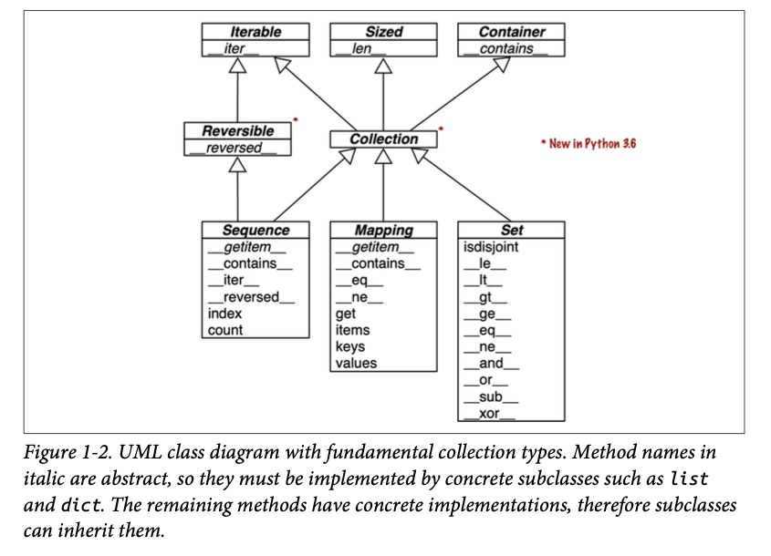

# The Python Data Model

The data model as a description of Python as a framework. It formalizes the
interfaces of the building blocks of the language itself.

The Python interpreter invokes special methods to perform basic object
operations, often triggered by special syntax. The special method names are
always written with leading and trailing double underscores.

Iteration is often implicit. If a collection has no `__contains__` methods, the
in operator does a sequential scan.

```py
suit_values = dict(spades=3, hearts=2, diamonds=1, clubs=0)
def spades_high(card):
    rank_value = FrenchDeck.ranks.index(card.rank)
    return rank_value * len(suit_values) + suit_values[card.suit]
for card in sorted(deck, key=spades_high):
  print(card)
```

If you need to invoke a special methods, it is usually better to call the
related built-in function. These built-ins call the corresponding special
method, but often provide other services and - for built-in types - are faster
than method calls.

By default, instances of user-defined classes are considered truthy, unless
either `__bool__` or `__len__` is implemented. Basically, bool(x) calls
`x.__bool__()` and uses the result. If `__bool__` is not implemented, Python
tries to invoke `x.__len__` and if that returns zero, bool returns False.

## Collection API

The interfaces of the essential collection types in the language. All the
classes in the diagram are ABCs - abstract base classes.



Each of the top ABCs has a single special method. The Collection ABC unifies the
three essentail interfaces that every collection should implement:

* Iterable to support for, unpacking, and other forms of iteration.
* Sized to support the len built-in function
* Container to support the in operator

By implementing special methods, your objects can behave like the built-in types
, enableing the expressive coding style the community considers Pythonic.
