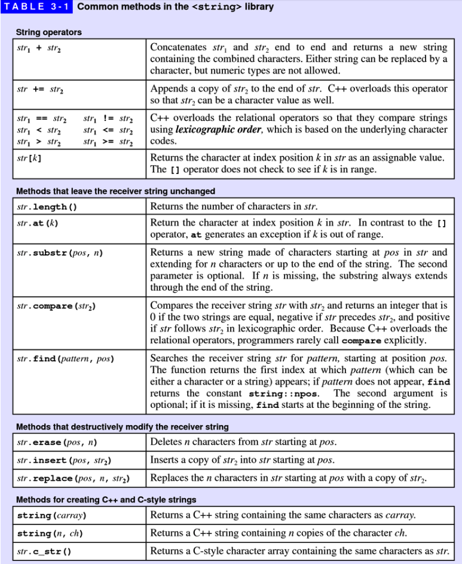
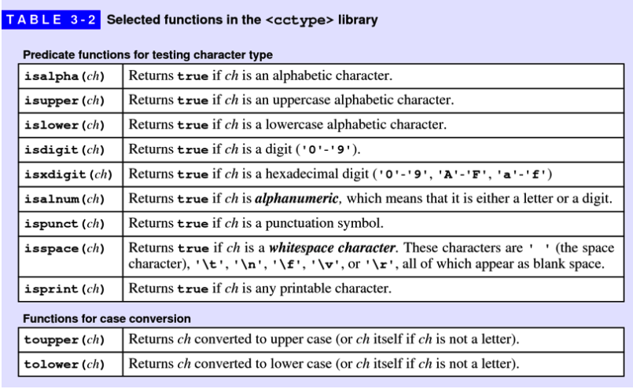
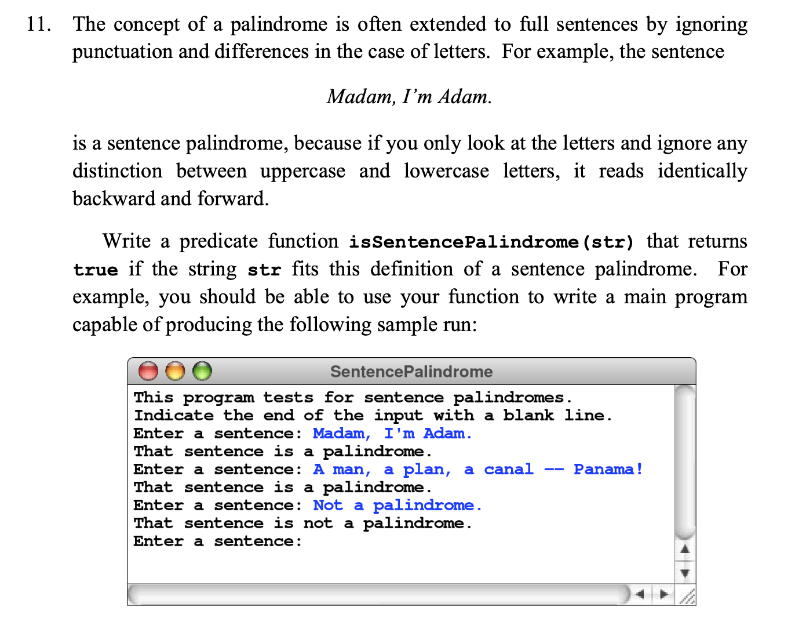
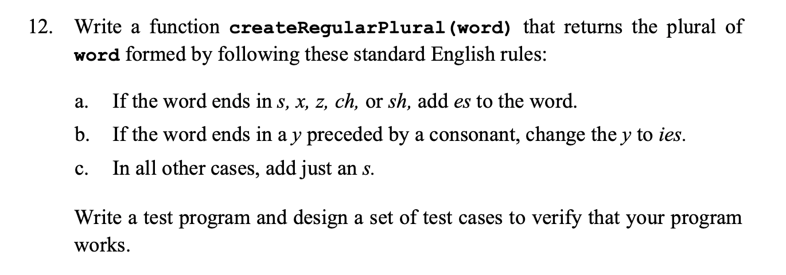
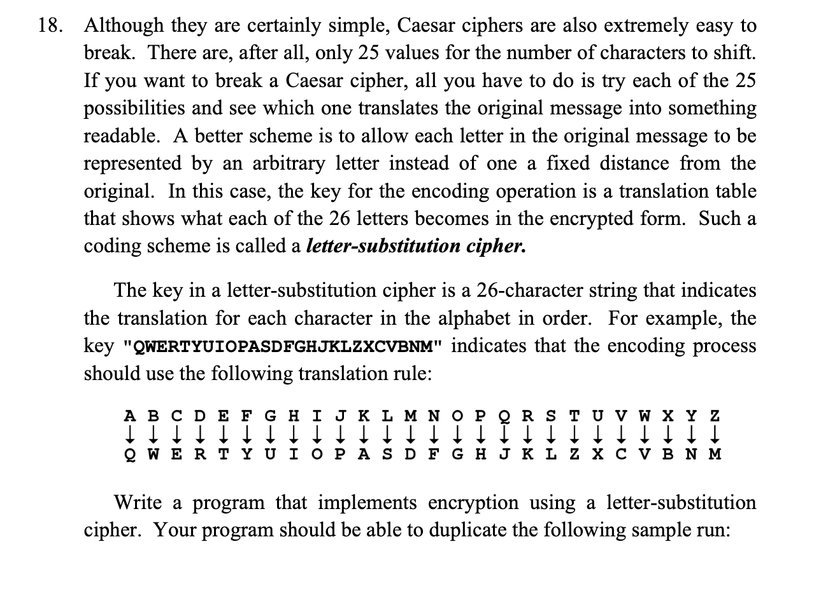
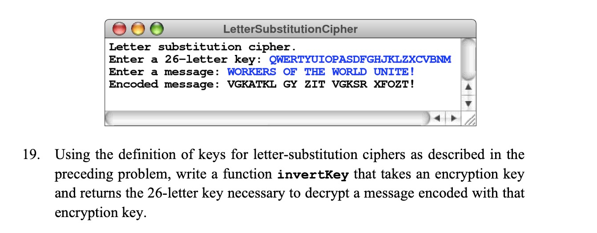

# Strings

 A string is a variable that stores a sequence of letters or other characters.
 The C++ `<string>` library, which provides a convenient abstraction for
 working with strings of characters.

## String operations

Refer [String class][1] for more details.



### Operator overloading

In computer programming, operator overloading, sometimes termed operator ad hoc
polymorphism, is a specific case of polymorphism, where different operators
have different implementations depending on their arguments.

In C++, we can make operators to work for user defined classes. This means C++
has the ability to provide the operators with a special meaning for a data
type, this ability is known as operator overload.

```c++
#include<iostream>
using namespace std;

class Complex {
private:
    int real, imag;
public:
    Complex(int r = 0, int i =0)  {real = r;   imag = i;}

    // This is automatically called when '+' is used with
    // between two Complex objects
    Complex operator + (Complex const &obj) {
         Complex res;
         res.real = real + obj.real;
         res.imag = imag + obj.imag;
         return res;
    }
    void print() { cout << real << " + i" << imag << endl; }
};

int main()
{
    Complex c1(10, 5), c2(2, 4);
    Complex c3 = c1 + c2; // An example call to "operator+"
    c3.print();
}
```

Refer [Operator Overload][2] for more details.

## The `<cctype>` library

The `<cctype>` library exports a variety of functions that work with characters.



## String application

### Translating English to Pig Latin

In Pig Latin, words are formed from their English counterparts by applying the
following rules:

1. If the word contains no vowels, no translation is done, which means that the
   translated word is the same as the original.
2. If the word begins with a vowel, the function adds the string "way" to the
   end of the original word.
3. If the word begins with a consonant, the function extracts the string of
   consonants up to the first vowel, moves that collection of consonants to
   the end of the word, and adds the string "ay".

Code: [PigLatin.cpp](./codes/PigLatin.cpp)

## Exercises

* exercises-11

  
  solution: [SentencePalindrome](./codes/exercises/SentencePalindrome.cpp)

* exercises-12

  
  solution: [RegularPlural.cpp](./codes/exercises/RegularPlural.cpp)

* exercises-18

  
  solution:

* exercises-19

  
  solution:

## References

* [Operator Overload][2]

## Source Code

* [HelloName.cpp](./codes/HelloName.cpp)
* [PigLatin.cpp](./codes/PigLatin.cpp)

[1]:<https://www.cplusplus.com/reference/string/string/>
[2]:<https://www.geeksforgeeks.org/operator-overloading-c/>

