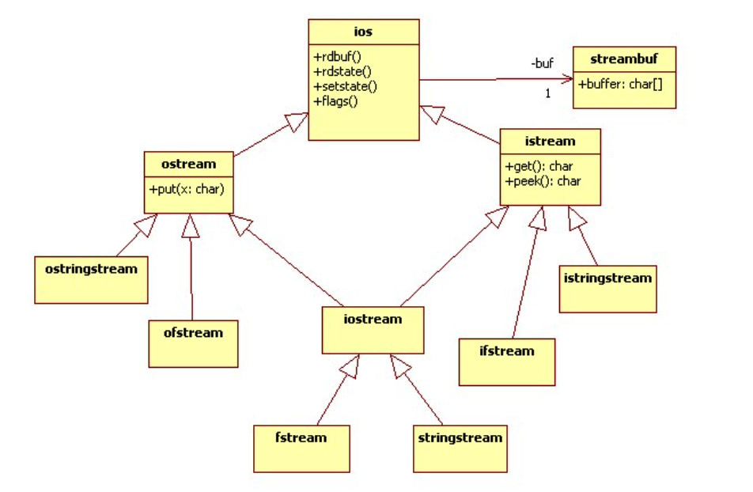
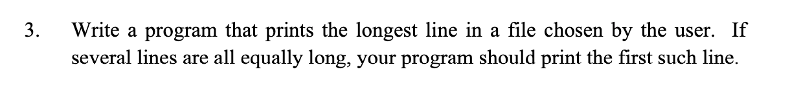
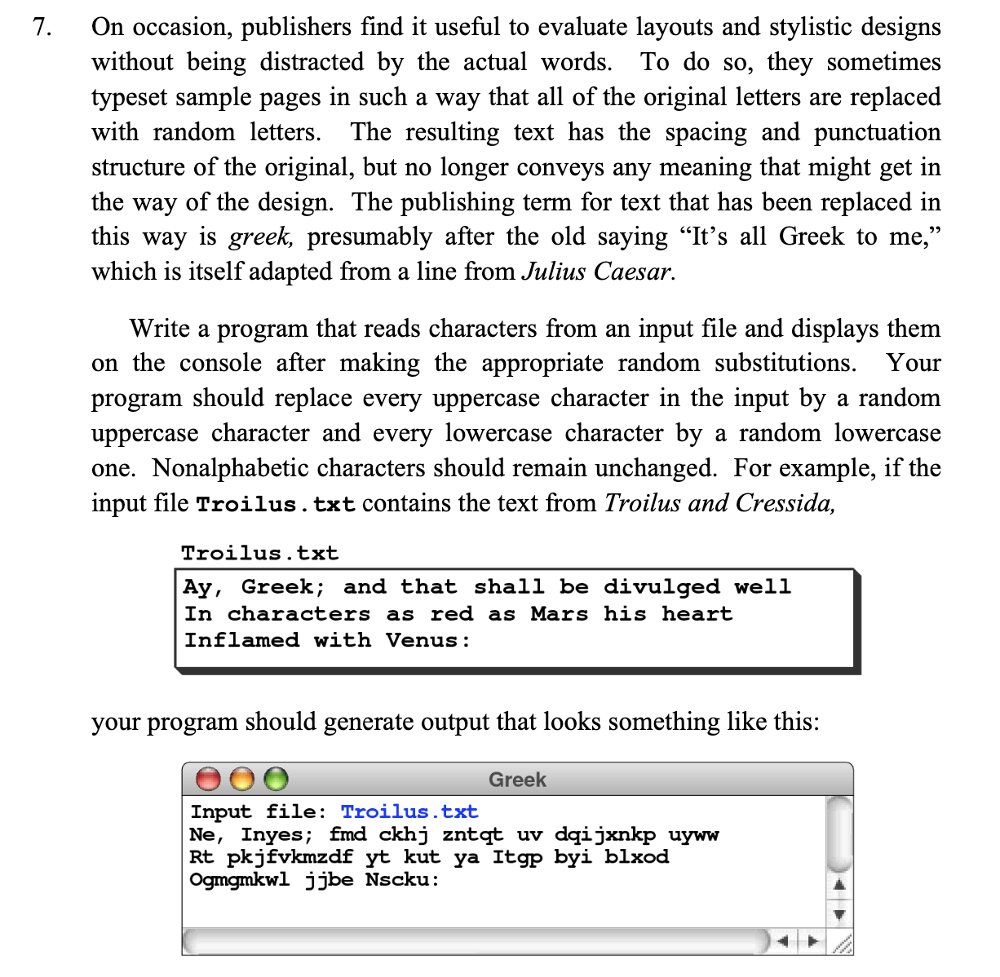
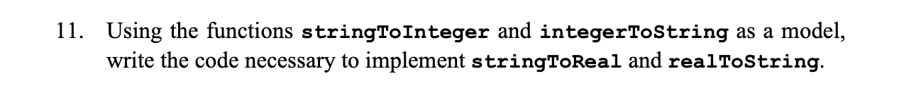

# Streams

## Formatted output and input

The insertion (<<) operator, which is preprogrammed for all standard C++ data
types, sends bytes to an output stream object.

This operator is called the insertion operator because it has the effect of
inserting data into a stream. The << operator is overloaded so that the operand
on the right can be a string or any primitive value. If this operand is not a
string, the << operator converts it to string form before sending it to the
output stream. This feature makes it easy to display the values of variables,
because C++ handles the output conversion automatically.

In C++ Streams:

* `<<` is insertion operator.
* `>>` is extraction operator.

### manipulator

Manipulators are functions specifically designed to be used in conjunction with
the insertion (<<) and extraction (>>) operators on stream objects.

Manipulators are used to change formatting parameters on streams and to insert
or extract certain special characters.

* Refer to [PrecisionExample.cpp](./codes/PrecisionExample.cpp) for a demo.
* Refer to [C++ Manipulators][1] for more details.

## Data files

### Single character I/O

Input streams in the C++ library support reading a single character using a
method called get, which exists in two forms.

```c++
int ch;
while ((ch = infile.get()) != EOF) {
  #Perform some operation on the character.
}
```

`infile.unget();` The effect of this call is to "push" the most recent
character back into the input stream so that it is returned on the next
call to get. The specifications for the C++ library guarantees that it will
always be possible to push one character back into the input file, but you
should not rely on being able to read several characters ahead and then push
them all back.

### Line-oriented I/O

The `getLine` function - which is defined as a free function rather than a
method - takes two references parameters: the input stream from which the line
is read and a string variable into which the result is written.

```c++
string line;
while (getline(infile, line)) {
  cout << line << endl;
}
```

* Refer to [ShowFileContents.cpp](./codes/ShowFileContents.cpp) for demo code.
* Refer to [`<ifstream>`][2] for more details.

## String streams

The `istringstream` class is the counterpart of `ifstream` and makes it
possible to use stream operators to read data from a string.

`istringstream stream(str);`

If you are declaring an object, C++ allows you to supply arguments after the
variable name that control how that object is initialized.

```c++
int stringToInteger(string str) {
  istringstream stream(str);
  int value;
  stream >> value >> ws;
  if (stream.fail() || !stream.eof()) {
    error("stringToInteger: Illegal integer format");
  }
  return value;
}

string integerToString(int n) {
  ostringstream stream;
  stream << n;
  return stream.str();
}
```

### Console input

The most effective way to ensure that user input is valid is to read an entire
line as a string and then convert that string to an integer.

* Refer to [GetInteger.cpp](./codes/GetInteger.cpp) for demo code.

## Class hierarchies

A class hierarchy or inheritance tree in computer science is a classification
of object types, denoting objects as the instantiations of classes
inter-relating the various classes by relationships such as "inherits",
"extends", "is an abstraction of", "an interface definition".

classes provide a framework for encapsulation, which is the process of
combining the data representation and the associated operations into a coherent
whole that reveals as few details as possible about the underlying structure.

* Sub Class: The class that inherits properties from another class is called
  Sub class or Derived Class.
* Super Class:The class whose properties are inherited by sub class is called
  Base Class or Super class.

### Choosing the right level in the stream hierarchy

One of the most important decisions you need to make when you use object
hierarchies is finding the right level at which to work. As a general rule,
it is best to write your code so that it uses the most general level in the
hierarchy that supports the operations you need.



## Summary

* The `<iostream>` library exports three standard streams: cin, cout, and cerr.
* The `<iomanip>` library makes it possible to control the output format.
* The `<fstream>` library in C++ supports reading and writing data files.
* The `<sstream>` library makes it possible to use the >> and << operators to
  read and write string data.

## Exercises

* exercises-3

  
  solution: [LongLine](./codes/exercises/LongLine.cpp)

* exercises-7

  
  solution: [RandomTextSub](./codes/exercises/RandomTextSub)

* exercises-11


solution: [StringReal](./codes/exercises/StringReal.cpp)

[1]:<http://www.cplusplus.com/reference/library/manipulators/>
[2]:<http://www.cplusplus.com/reference/fstream/ifstream/?kw=ifstream>