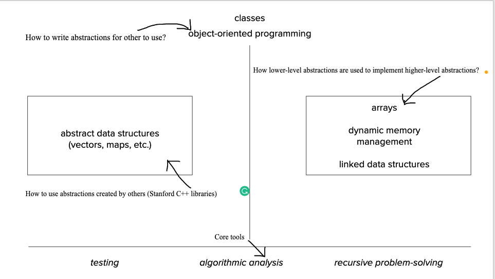
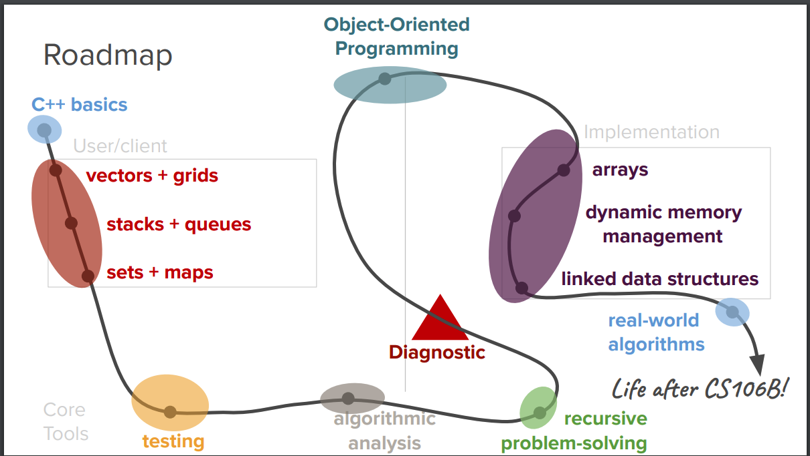

# Abstraction

## Lecture Meta

* Themes: Programming Abstractions
* [Slides][1]

## Notes

### Key Terms

CS education is more than just "learning to code"!

* **Coding** as a technical skill
* **Computer science** as an academic discipline
* **Computational thinking** as a problem-solving process

### What is abstractions

> Design that hides the details of how something works while still allowing the
> user to access complex functionality.

Programming languages are abstractions through which we communicate with
computers.

### Course Roadmap

[1]:<https://web.stanford.edu/class/cs106b/lectures/01-welcome/Lecture1Slides.pdf>
"lecture slides"
