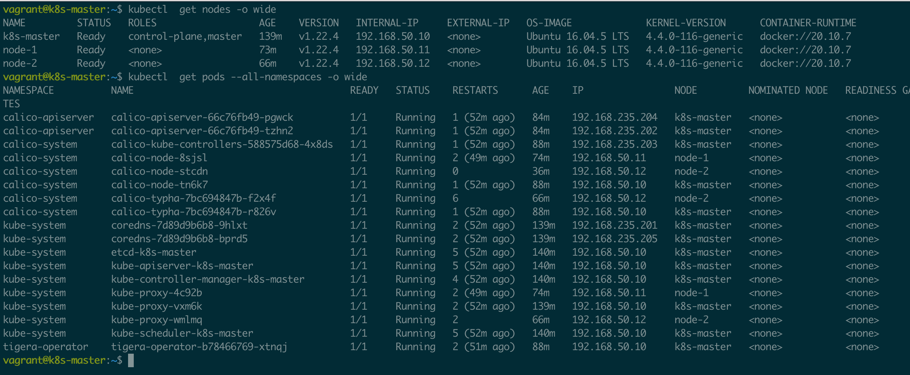

# Building Kubernetes cluster using vagrant and ansible

This project demonstrate the procedure for deploying a Kubernetes cluster using
vagrant and ansible.

## Multi node kubernetes cluster

Multi node kubernetes cluster offer a production-like environment which has
various advantages.

* Vagrant is a tool that will allow us to create a virtual environment easily
  and it eliminates pitfalls that cause the works-on-my-machine phenomenon.
* Ansible is an infrastructure automation engine that automates software
  configuration management.

## 网络问题

### 手动下载官方镜像到本地

### Kubeadm images

To list all image being use then issue the `kubeadm init`.

```shell
$ kubeadm config images list
k8s.gcr.io/kube-apiserver:v1.22.4
k8s.gcr.io/kube-controller-manager:v1.22.4
k8s.gcr.io/kube-scheduler:v1.22.4
k8s.gcr.io/kube-proxy:v1.22.4
k8s.gcr.io/pause:3.5
k8s.gcr.io/etcd:3.5.0-0
k8s.gcr.io/coredns/coredns:v1.8.4
```

### 切换对应的镜像源

```yaml
- name: Initialize the Kubernetes cluster using kubeadm
  command: kubeadm init --apiserver-advertise-address="192.168.50.10"
        --apiserver-cert-extra-sans="192.168.50.10"
        --node-name k8s-master
        --pod-network-cidr=192.168.0.0/16
        --image-repository="registry.cn-hangzhou.aliyuncs.com/google_containers"
```

使用 `registry.cn-hangzhou.aliyuncs.com/google_containers` 做为新的镜像源。

## Configuring a cgroup driver

Refer to [Configuring a cgroup driver](https://kubernetes.io/docs/tasks/administer-cluster/kubeadm/configure-cgroup-driver/).

### Using cgroupfs driver

```yaml
 - name: Configure node ip
    lineinfile:
      path: /etc/default/kubelet
      line: KUBELET_EXTRA_ARGS=--node-ip={{ node_ip }} --cgroup-driver=cgroupfs
      create: yes
```

### Using systemd drive

Refer to [configure docker using systemd](https://stackoverflow.com/questions/52119985/kubeadm-init-shows-kubelet-isnt-running-or-healthy)



## References

* [Kubernetes Setup](https://kubernetes.io/blog/2019/03/15/kubernetes-setup-using-ansible-and-vagrant/)
* [Quickstart for Calico on Kubernetes](https://docs.projectcalico.org/getting-started/kubernetes/quickstart)
* [kubeadm-ansible](https://github.com/kairen/kubeadm-ansible)
* [kubeasz](https://github.com/easzlab/kubeasz)
