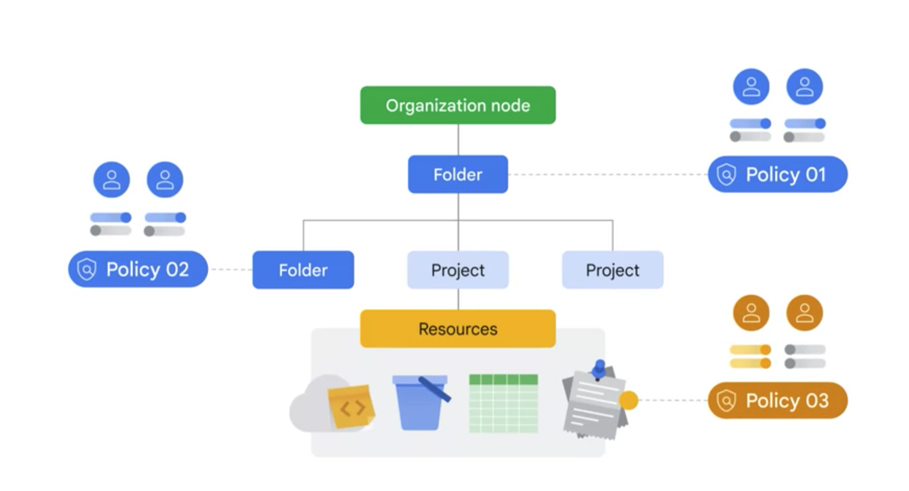
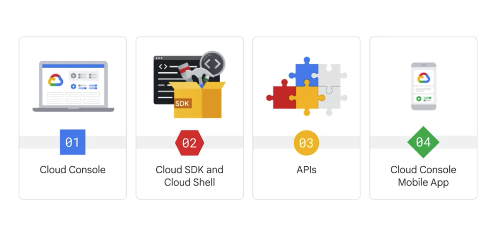
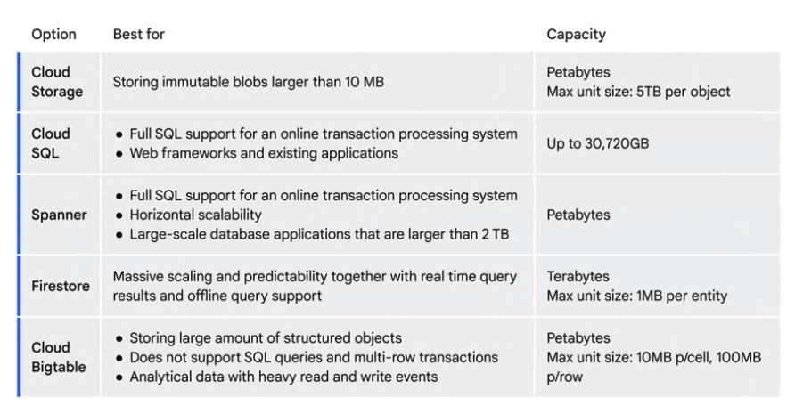

# GCloud Core Infrastructure

## IAM(Identity and Access Management)

IAM lets you grant granular access to specific Google Cloud resources and
helps prevent access to other resources. IAM lets you adopt the security
principle of least privilege, which states that nobody should have more
permissions than they actually need.

With IAM, you manage access control by defining who (identity) has what
access (role) for which resource.

An allow policy, also known as an IAM policy, defines and enforces what
roles are granted to which principals. Each allow policy is attached to a
resource. When an authenticated principal attempts to access a resource,
IAM checks the resource's allow policy to determine whether the action
is permitted.

* Principal. A principal can be a Google Account (for end users), a service
  account (for applications and compute workloads), a Google group, or a
  Google Workspace account or Cloud Identity domain that can access a
  resource. Each principal has its own identifier, which is typically an
  email address.
* Role. A role is a collection of permissions. Permissions determine what
  operations are allowed on a resource. When you grant a role to a principal,
  you grant all the permissions that the role contains.
* Policy. The allow policy is a collection of role bindings that bind one or
  more principals to individual roles. When you want to define who
  (principal) has what type of access (role) on a resource, you create an
  allow policy and attach it to the resource.

### Resource hierarchy

Google Cloud resources are organized hierarchically, where the
organization node is the root node in the hierarchy, the projects are
the children of the organization, and the other resources are descendants
of projects.

### Interacting with GCloud

The Google Cloud console provides a web-based, graphical user interface
that you can use to manage your Google Cloud projects and resources.

## VPC(Virtual Private Cloud networking)

A secure, individual, private cloud-computing model hosted within a
public cloud. Virtual Private Cloud(VPC) provides networking functionality
to Computer Engine virtual machine(VM) instances, Google Kubernetes
Engine(GKE) clusters, and the App Engine flexible environment. VPC
provides networking for your cloud-based resources and services that
is global, scalable, and flexible.

A VPC network is a global resource that consists of a list of regional
virtual subnetwork(subnets) in data centers, all connected by a global
wide area network. VPC networks are logically isolated each other in
Google Cloud.

### VPC sharing and peering

#### Share VPC

You can share a VPC network from one project to other projects in your
Google Cloud organization. You can grant access to entire Shared VPC
networks or select subnets therein by using specific IAM permissions.
This lets you provide centralized control over a common network
while maintaining organizational flexibility.

#### VPC Network Peering

PC Network Peering lets you build software as a service (SaaS) ecosystems
in Google Cloud, making services available privately across different
VPC networks.

With VPC Network Peering, all communication happens by using internal
IP addresses. Subject to firewall rules, VM instances in each peered
network can communicate with one another without using external IP
addresses.

### Cloud Load Balancing

A load balancer distributes user traffic across multiple instance of
your application. Cloud Load Balancing is a fully distributed,
software-defined managed service.

## Storage

* Persistent Disks for block storage
* Filestore for network file storage
* Cloud Storage for object storage.

### Cloud Storage

Google Cloud Storage is the object storage service offered by Google Cloud.
It provides some very interesting out-of-the-box features such as object
versioning or fine-grain permissions (per object or bucket), that can make
development easy and help reduce operational overheads.

