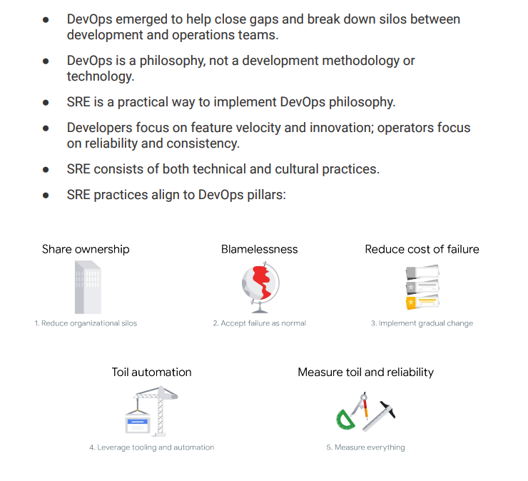

# Site Reliability Engineering

Site Reliability Engineering(SRE) is the practice of balancing the velocity of
development features with the risk to reliability.

## The mission of SRE

To protect, provide for, and progress software and systems with
consistent focus on availability, latency, performance, and capacity.

## Postmortems

### The components of postmortem

* Details of the incident and its timeline
* The actions taken to mitigate or resolve the incident.
* The incident's impact
* Its trigger and root cause or causes
* The follow-up actions to prevent its recurrence

### SLOs and error budgets

Error Budget: The amount of unreliability you are willing to tolerate.

Failure are documented in postmortems, which focus on systems and
processes versus people.
