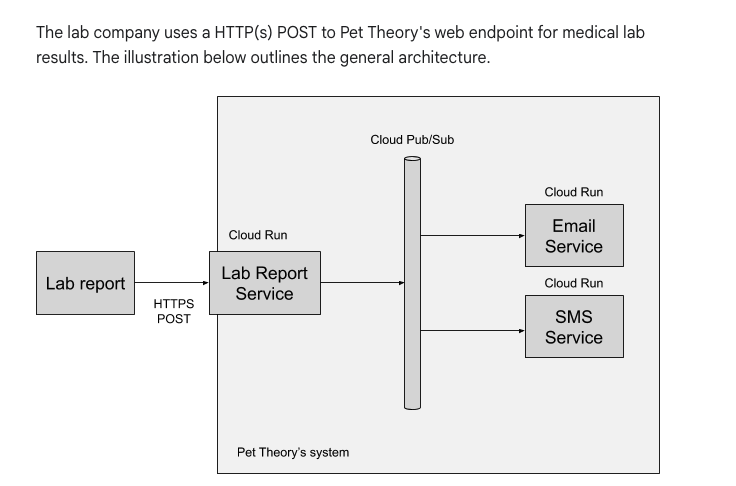

# Build a Resilient asynchronous System with Cloud Run and Pub/Sub

* Create a Pub/Sub topic and subscription
* Create a Cloud Run service that receives HTTP requests and publishes messages to Cloud Pub/Sub
* Create a Cloud Run service that receives messages from Cloud Pub/Sub
* Create a Pub/Sub subscription that triggers a Cloud Run service
* Test the resiliency of a system



```sh
gcloud pubsub topics create new-lab-report
git clone https://github.com/rosera/pet-theory.git

# Deploy the service
gcloud builds submit \
  --tag gcr.io/$GOOGLE_CLOUD_PROJECT/lab-report-service
gcloud run deploy lab-report-service \
  --image gcr.io/$GOOGLE_CLOUD_PROJECT/lab-report-service \
  --platform managed \
  --region us-west1 \
  --allow-unauthenticated \
  --max-instances=1

# Create a service account that will used to trigger the services responding to Pub/Sub messages
gcloud iam service-accounts create pubsub-cloud-run-invoker --display-name "PubSub Cloud Run Invoker"

# Give the service account permission to invoke the service
gcloud run services add-iam-policy-binding email-service --member=serviceAccount:pubsub-cloud-run-invoker@$GOOGLE_CLOUD_PROJECT.iam.gserviceaccount.com --role=roles/run.invoker --region us-west1 --platform managed

# Create a Pub/Sub subscription for the service
gcloud pubsub subscriptions create email-service-sub --topic new-lab-report --push-endpoint=$EMAIL_SERVICE_URL --push-auth-service-account=pubsub-cloud-run-invoker@$GOOGLE_CLOUD_PROJECT.iam.gserviceaccount.com
```

1. If service communicate asynchronously with each other via Pub/Sub instead of calling each other directly, the system can be more resilient.
2. Cloud Pub/Sub handled the retries, the services didn't have to. Services are only required to return a status code: success or failure.
3. If service goes down, the system is capable of automatically "healing" itself when the service comes back online, thanks to Pub/Sub retries.
