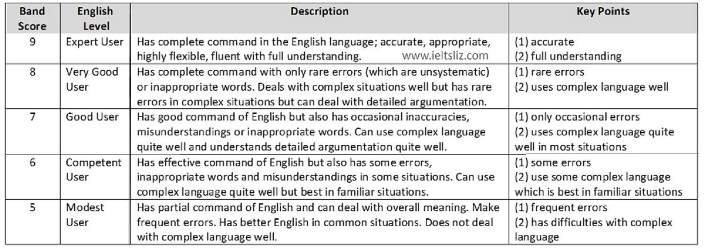

# IELTS

The International English Language Testing System (IELTS) is designed to help
you work, study or migrate to a country where English is the native language.
Your ability to listen, read, write and speak in English will be assessed during
the test. IELTS is graded on a scale of 1-9.

## Learning materials

* The Official Cambridge to IELTS
* Cambridge Practice tests for IELTS Series 9-14

## Test format

* Academic module

  Choose this if you wish to study at undergraduate or postgraduate levels, or
  if you are seeking professional registration, e.g. doctors and nurses.

* General Training module

  Choose this if you wish to migrate to an English-speaking country, (e.g.
  Australia, Canada, New Zealand, UK) or if you wish to train or study at
  below degree level.

## Exam modules

| Paper  | Content  |  Time |
|---|---|---|
|  Listening | 40 questions | Approximately 3- minute(plus10 minutes's transfer time)  |
|  Reading | 40 questions  |  60 minutes |
|  Writing | 2 tasks  | 60 minutes  |
|  Speaking | 3 parts  | 11-14 minutes  |

## Scores

* [ielts scores explained](https://takeielts.britishcouncil.org/teach-ielts/test-information/ielts-scores-explained)
* [ielts-band-scores](https://ieltsliz.com/ielts-band-scores/)

## Modules

There are two types of  IELTS:  Academic and General Training. All test takers
take the same Listening and Speaking tests but different Reading and Writing
tests. Make sure that you prepare for the correct test type.

The Listening, Reading and Writing sections of all IELTS tests are completed on
the same day, with no breaks in between them.

The Speaking section, however, can be completed up to a week before or after the
other tests. The total test time is 2 hours and 45 minutes.

* [Listening](./modules/listening/README.md)
* [Reading](./modules/Reading/README.md)
* [Writing](./modules/Writing/README.md)
* [Speaking](./modules/Speaking/README.md)

## References

* [IELTS Full Course in 10 hours - 2021](https://www.youtube.com/watch?v=Jzps8q2es7c)
* [IELTS Test Modules](https://www.ielts.org/for-test-takers/test-format)
* [What is IELTS](https://www.ielts.org/about-ielts/what-is-ielts)