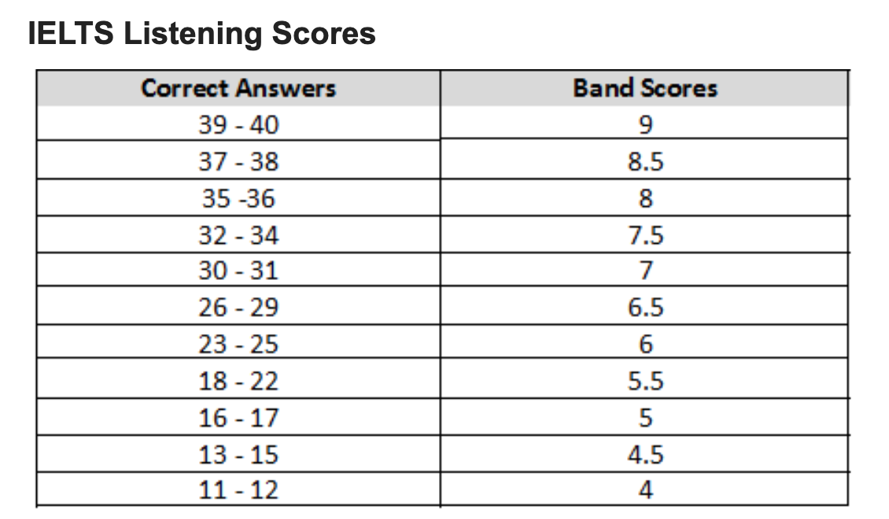

# Listening

## Description

* Timing: Approximately 30 minutes (plus 10 minutes transfer time).
* No. of questions: 40
* Task types: A variety of question types are used, chosen from the following:
  multiple choice, matching, plan/map/diagram labelling, form/note/table/
  flow-chart/summary completion, sentence completion.
* Answering: Test takers write their answers on the question paper as they
  listen and at the end of the test are given 10 minutes to transfer their
  answers to an answer sheet. Care should be taken when writing answers on the
  answer sheet as poor spelling and grammar are penalised.
* Marks: Each question is worth 1 mark.

## Format & Difficulty

You will listen to four recordings of native English speakers and then write
your answers to a series of questions.

* Recording 1 – a conversation between two people set in an everyday social
  context.[Very Easy]
* Recording 2 – a monologue set in an everyday social context, e.g. a speech
  about local facilities.[Easy]
* Recording 3 – a conversation between up to four people set in an educational
  or training context, e.g. a university tutor and a student discussing an
  assignment.[Very Difficult]
* Recording 4 – a monologue on an academic subject, e.g. a university
  lecture.[Difficult]

## Abstraction

1. Two reasons to not get 9 bands

* Non-native Speakers
* Not engrossed with the language.[Everyday 2 or 3 hour listening]

English Songs + Lyrics[joy of learning]

1. Dimensions

* Speed
* Distractions
* Types of questions
* No breaks within the section[Section IV]

### Introduction to accent

The recordings are heard only once. They include a range of accents, including
British, Australian, New Zealand, American and Canadian. 80-90% are
British Accent.

### Skills

* Alphabet
* numbers
  * 0 naught or nought
  * 0 null
  * 0 zero
  * 0 Oh
* Note down the numbers in the mini pause.
* Pronunciation [Dictionary Cambridge](https://dictionary.cambridge.org/)

## IELTS Listening in detail

### Multiple choice

 In multiple choice tasks, there is a question followed by three possible
 answers, or the beginning of a sentence followed by three possible ways
 to complete the sentence. Test takers are required to choose the one correct
 answer - A, B or C.

* Lot to read and listen at the same time.(Speed reading: 350w-400w/minutes)
* Concise the information

### Matching

Test takers are required to match a numbered list of items from the listening
text to a set of options on the question paper. The set of options may be
criteria of some kind.

* When in doubt, keep two answers.

### Plan, map, diagram labelling

Test takers are required to complete labels on a plan (eg of a building),
map (eg of part of a town) or diagram (e.g. of a piece of equipment).
The answers are usually selected from a list on the question paper.

* Origin or starting point [Always recognize the starting point]
* Follow using a pointer [Guided by the audio]
* Keep an eye on the Landmarks
* Basic Direction Related Vocabulary

### Form, note, table, flow-chart, summary completion

Test takers are required to fill in the gaps in an outline of part or of all
of the listening text. The outline will focus on the main ideas/facts in
the text. It may be:

1. a form: often used to record factual details such as names
2. a set of notes: used to summarize any type of information using the layout
  to show how different items relate to one another
3. a table: used as a way of summarizing information which relates to clear
  categories – e.g. place/time/price,
4. a flow-chart: used to summarize a process which has clear stages, with the
  direction of the process shown by arrows.

* Always read the constructions
* Predictions[number or noun or time]
* Information in a sequence
* Rows and columns
* Units and Names[$, kg, pm]

### Sentence Completion

Test takers are required to read a set of sentences summarizing key information
from all the listening text or from one part of it. They then fill a gap in each
sentence using information from the listening text.

* Read and predict. [read before audio, and predict the answer]
* Sentence can be paraphrased.[Answers have to be exact words]
* If it doesn't fit grammatically, its incorrect.
* Write the answers as quick as possible in question paper.

### Short-answer questions

 Test takers are required to read a question and then write a short answer
 using information from the listening text.

* W-Questions: When What Why
* Number of words
* Guessing answers for questions
* Stay ahead of the audio
* Paraphrases
* Synonyms
* Spelling

## IELTS Listening - marked

A Band Score conversion table is produced for each version of the Listening test
which translates scores out of 40 into the IELTS 9-band scale. Scores are
reported in whole bands and half bands.

One mark is awarded for each correct answer in the 40-item test. Care should be
taken when writing answers on the answer sheet as poor spelling and grammar
are penalised.

