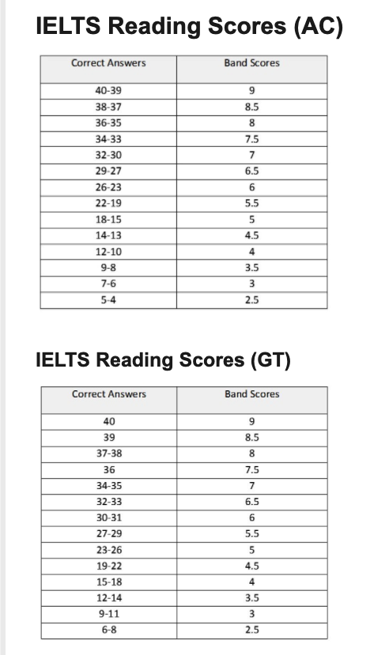

# Reading

The Reading section consists of 40 questions, designed to test a wide range of
reading skills. These include reading for gist, reading for main ideas, reading
for detail, skimming, understanding logical argument and recognizing writers'
opinions, attitudes and purpose.

IELTS General Training test - this includes extracts from books, magazines,
newspapers, notices, advertisements, company handbooks and guidelines.
These are materials you are likely to encounter on a daily basis in an
English-speaking environment.

## Description

* Paper format:

  * Section 1 may contain two or three short texts or several shorter texts.
  * Section 2 comprises two texts.
  * Section 3, there is one long text.
* Timing: 60 minutes
* No. of questions: 40
* Marks: Each question is worth 1 mark.

### Section sources

* first section: **social survival**

  contains texts relevant to basic linguistic survival in
  English with tasks mainly about retrieving and providing general factual
  information, for example, notices, advertisements and timetables.

* second section: **Workplace survival**

  focuses on the workplace context, for example, job descriptions, contracts
  and staff development and training materials.

* third section: **general reading**

  involves reading more extended prose with a more complex structure. Here,
  the emphasis is on descriptive and instructive rather than argumentative
  texts, in a general context relevant to the wide range of test takers
  involved, for example, newspapers, magazines and fictional and
  non-fictional book extracts.

## IELTS Reading in detail

### Multiple choice

## Multiple Choice

 In this task type, test takers choose the best answer from four alternatives
 A, B, C or D, or the best two answers from five alternatives
 (A, B, C, D or E), or the best three answers from seven alternatives
 (A, B, C, D, E, F or G). They write the letter of the answer they have chosen
 on the answer sheet.

* Always read question first then move to the passage.
* Never Read the options first

### Identifying information

The test taker will be given a number of statements and asked: ‘Do the following
statements agree with the information in the text?’ They then write ‘true’,
‘false’ or ‘not given’ in the boxes on their answer sheets. The questions are
in the same order as the information in the text: that is, the answer to the
first question in this group will be located in the text before the answer to
the second question and so on.

#### clarification

* **False**: the passage states the opposite of the statement in question
* **Not Given**: the statement is neither confirmed nor contradicted by the
  information in the passage.
* Any knowledge students bring with them from outside the passage should not
  play a part when deciding on their answers.
* Never write in short. [T/F/NG]
* No time: Take a guess.
  * If information is changed  = No Given or False
  * If subject is changed = Not Given
  * If it is taking long to find  = Not Given

### Matching information

 Test takers locate **specific information** in the lettered paragraphs/sections
 of a text, and write the letters of the correct paragraphs/sections in the
 boxes on their answer sheet. They may be asked to find; specific details, an
 example, a reason, a description, a comparison, a summary, an explanation.
 They will not necessarily need to find information in every paragraph/section
 of the text, but there may be more than one piece of relevant information in
 a given paragraph/section.

### Matching Heading

 Test takers are given a list of headings, usually identified with lower-case
 Roman numerals (i, ii, iii, etc.), referring to the **main idea of the paragraph
 or section** of the text. They must match the heading to the correct paragraphs
 or sections, which are marked alphabetically, and write the appropriate Roman
 numerals in the boxes on their answer sheets.

* Always solve this type first.
  * Because you kind of remember the passage.
  * You have to read the whole passages.
* Read the paragraph first.
* Understand the theme of the paragraph
* Justify each word of the heading with the paragraph.

### Matching Feature

Test takers match a set of statements or pieces of information to a list of
options. These are a group of features from the text, and are identified
by letters. This task assesses the ability to recognize relationships and
connections between facts in the text, and to recognize opinions and theories.

* Always the question first, then move to the passage.
* Keywords
* Eliminate

### Sentence Completion

Test takers complete sentences in a given number of words taken from the text,
writing their answers on the answer sheet. This task type assesses the test
takers' ability to locate detail/specific information.

### Summary, note, table, flow-chart completion

Test takers are given a summary of a section of the text, and are required to
complete it with information drawn from the text. Note that the summary will
usually be of only one part of the passage rather than the whole. The given
information may be in the form of; several connected sentences (referred to as
a summary), several notes (referred to as notes), a table with some of its cells
empty or partially empty (referred to as a table), a series of boxes or steps
linked by arrows to show a sequence of events, with some of the boxes or steps
empty or partially empty (referred to as a flow-chart). The answers will not
necessarily occur in the same order as in the text. However, they will usually
come from one section rather than the entire text.

* To know the Word Count, by Reading the instructions
* Predict - Using the rows and columns and other cells
* Sequence - Answers appear in the same sequence as the question
* Grammar and Spelling

### Diagram label completion

Test takers complete labels on a diagram which relates to a description
contained in the text. This task type assesses the ability to understand a
detailed description, and to relate it to information presented in the form
of a diagram.

### Short-answer questions

Test takers answer questions about factual details in the text. Test takers must
write their answers in words or numbers on the answer sheet. Test takers must
write their answers using words from the text.

## Reading Scores

A band score conversion table is produced for each version of the General
Training Reading test which translates scores out of 40 into the IELTS 9-band
scale. Scores are reported in whole bands and half bands.

