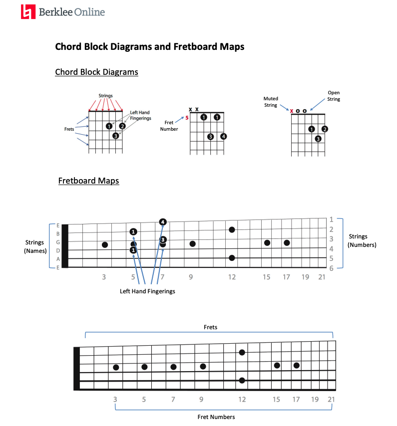
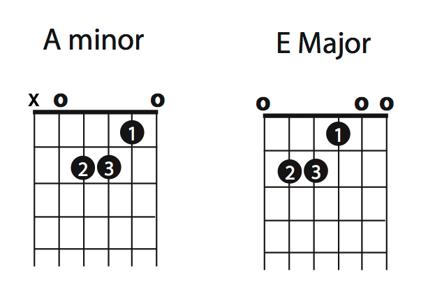

# Week-1

## Choosing Acoustic Or Electric Guitar

Choose the instruments that inspire you to play.

## Essential accessories for Acoustic guitar

* protected case
* strap
* extra strings
* metronome
* pick up
* tuner
* string winder
* humidifier
* capo

## Chord block diagrams and fretboard maps

## A Minor and E Major Chords

